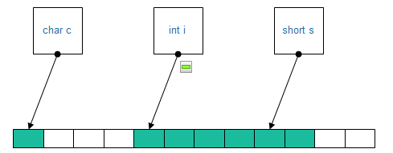

#  其他

## ⭐源码->可执行程序

1. 预编译，处理代码文件中”#“开头的指令，处理注释
   但是保留 **所有的#pragma编译器指令**
   **生成xxx.i文件**
2. 编译，把 xxx.i 文件进行词法分析、语法分析、语义分析之后，优化，**生成对应的汇编代码文件xxx.s**
3. 汇编，把汇编代码变为机器可以执行的指令（机器码文件），**生成目标文件windows-xxx.o，linux-xxx.obj**
4. 链接，把不同源文件产生的目标文件进行链接，成为一个可执行程序
   1. 静态链接，在使用静态库的时候，**链接器	从库中复制这些函数和数据**，并把他们和应用程序的其他模块组合起来
      缺点：空间浪费，副本需要额外的运行时存储空间
      缺点：更新困难
      优点：运行速度快
   2. 动态链接，只有在程序运行的时候才把模块链接成一个程序（根据地址），共享库文件不需要副本
      缺点：速度性能损耗

### 详细描述链接过程

链接：https://www.jianshu.com/p/147e70f0a74c

---

## ⭐内存对齐

可以通过**预编译命令#pragma pack(n)**，n=1,2,4,8,16来改变这一系数，其中的n就是指定的“对齐系数”。

**此外，GNU使用\_\_attribute\_\_选项来设置** 

```cpp
struct stu{
    char sex;
    int length;
    char name[10];
}__attribute__ ((aligned (1))); 
struct stu my_stu;
```

1. 第一个数据成员放在offset为0的地方，以后每个数据成员的对齐按照#pragma pack指定的数值和这个数据成员自身长度中，比较小的那个进行。**根本原则是每个成员的起始位的offset都应该与对齐长度的整数倍同余，而这个同余数明显应该是0！**
2. 在数据成员完成各自对齐之后，**类(结构或联合)本身也要进行对齐**，对齐将按照#pragma pack指定的数值和结构(或联合)最大数据成员长度中，比较小的那个进行。

```cpp
#include<iostream>
using namespace std;
class test {
private :
    char c='1';//1byte 
    int i;//4byte
    short s=2;//2byte
};

int main(){
    cout << sizeof(test) << endl;
    return 0;
}
```

输出：12



```cpp
class test2 {
private:
    int i;//4byte
    char c = '1';//1byte 
    short s = 2;//2byte
};

int main(){
    cout << sizeof(test2) << endl;
    return 0;
}
```

输出：8

**使用#pragma pack(n)**

```cpp
#include<iostream>
using namespace std;
#pragma pack(1)//设定为 1 字节对齐
class test {
private :
    
    char c='1';//1byte 
    int i;//4byte
    short s=2;//2byte
};

class test2 {
private:
    int i;//4byte
    char c = '1';//1byte 
    short s = 2;//2byte
};
int main(){
    cout << sizeof(test) << endl;
    cout << sizeof(test2) << endl;
    return 0;
}
```

### 为什么要字节对齐

比如在32位cpu下，假设一个整型变量的地址为0x00000004，那它就是自然对齐的。

**需要字节对齐的根本原因在于CPU访问数据的效率问题。****

假设上面整型变量的地址不是自然对齐，比如为0x00000002，则CPU如果取它的值的话需要访问两次内存，第一次取从0x00000002-0x00000003的一个short，第二次取从0x00000004-0x00000005的一个short然后组合得到所要的数据

如果变量在0x00000003地址上的话则要访问三次内存，第一次为char，第二次为short，第三次为char，然后组合得到整型数据。

而如果变量在自然对齐位置上，则只要一次就可以取出数据。一些系统对对齐要求非常严格，比如sparc系统，如果取未对齐的数据会发生错误，举个例：
　　　 

```cpp
char ch[8];
char *p = &ch[1];
int i = *(int *)p;
```
 运行时会报segment error，而在x86上就不会出现错误，只是效率下降。

### 什么时候需要设置对齐

 在设计不同CPU下的通信协议时，或者编写硬件驱动程序时寄存器的结构这两个地方都需要按一字节对齐。即使看起来本来就自然对齐的也要使其对齐，以免不同的编译器生成的代码不一样.

---

## ⭐const和define的区别

处理者：const由编译器处理，define由预处理器处理

const有类型安全检查

const定义的常量存储在**数据段常量区/data segment**，而define只是简单替换

**补充**

constexpr

将变量声明为constexpr类型以便由编译器来**验证变量是否是一个常量表达式**（不会改变，在编译过程中就能得到计算结果的表达式）。是一种比const更强的约束，这样可以得到更好的效率和安全性。

**只有在编译期能确定才能通过编译**

------

## ⭐介绍static（c++）

1. 全局静态变量：其他文件不可见，生命周期完全
2. 局部静态变量：作用域为大括号区段
3. 静态函数：其他文件不可见
4. 静态函数成员：没有this指针，直接通过class访问

---

## ⭐介绍四种cast转换

1. const_cast：除了可以改变const，**还可以改变变易性（volatile）**
2. static_cast：拥有与C旧式转型的威力，用于各种隐式转换，后果未知
3. dynamic_cast：用于类层次间的向上和向下转化，只能转指针或引用。
   只能协助巡航于继承体系，**但是向下转换的时候无法应用在缺乏虚函数的类型身上**，原因是没有虚函数就不会有虚函数表，自然就不存在类型描述器，向下转化的时候父类就不知道目的地的类型是什么，编译期就报错了。
4. reinterpret_cast：最常用用途是转换“函数指针”类型
   用来处理无关类型的指针，**但是需要与原值有相同比特位数**
   **神奇用途：临时隐藏该指针类型，让他成为“只携带地址”的指针**
   PS：该转换不具有移植性

---

## ⭐内存泄漏的几种情况

**1.没有匹配地调用new/delete操作**

一是在heap中创建了对象占用了内存，但是没有显式地释放所占用的内存。

二是在类构造的时候对于可变大小的member动态分配了内存，但是在析构函数中没有对应地释放内存。

**2.没有正确地清除嵌套的对象指针**

**3.delete释放对象数组时没有使用[ ]**

在定义了析构函数，对象数组中的元素确实需要进行有效析构（内置类型就不需要，不写[ ]并不会出问题），且析构函数功能完备的情况下。

如果没有使用[ ]来delete一个对象数组，那么只会析构，释放数组的第一个对象。

其他元素会依然存在，但是！相关内存已经要求归还了。

而对于[ ]中是否需要指定元素个数，在Jonathan的原始版本中会优先采用程序员指定的size。

但是几乎新进所有的C++编译器都不考虑程序员的显式指定。

**4.指向对象的指针数组**

在定义了析构函数，对象数组中的元素确实需要进行有效析构（内置类型就不需要，不写[ ]并不会出问题），且析构函数功能完备的情况下。

即使delete [ ] ptr_arr，但是释放的只是指针所拥有的空间，指针指向的对象所拥有的空间仍然被占用，而且我们会失去对它们的控制。

解决方法就是迭代遍历整个数组手动调用析构函数。

**5.缺少拷贝构造函数/=号运算符重载**

假设某个class内含一些指向heap空间的指针。

而使用者没有提供一个显式的拷贝构造函数，此时如果此class的结构让编译器不能触发bitwise语义，那么在需要拷贝构造的场景下（比如以值传递实参转入形参），编译器就会触发memberwise语义，构造出一个逐member复制的拷贝构造函数。

很明显，如果在memberwise copy的情况下，会造成两个不同指针指向同一块heap空间的情况。

而如果此时的使用者编写了完备的析构函数，那么就会造成两次对同一heap空间内存的释放，这会导致heap空间的崩溃。

heap空间崩溃，内存自然就泄漏了。

**6.返回不可控栈上空间**

主要点在于栈上空间由操作系统管理，而不是编译器/程序员管理，所以对于一些栈空间我们是不可控的（比如函数内部临时开的栈）。

我们可以得到一个栈空间内的地址并进行访存，但是如果这块栈的“生命”结束了，我们继续使用这个地址进行访存，就可能破坏某些操作系统功能，于是程序崩溃，内存泄漏。

**7.free( )之后没有将指针滞空**

free( )这个C library函数只是告诉编译器/操作系统：我放弃了这块内存的控制权，你可以使用了。

但是事实上是否放弃这块内存还是取决于程序员的行为，也就是说你可以free之后继续使用这块内存，但是此时操作系统也有管理权，于是我们就可能使用到“垃圾内存”。

这与上一点本质上是一样的，都是访问到了受限/不合法的内存，有可能造成程序的崩溃。

**8.继承链中的base class没有将析构函数设置为virtual**

```cpp
class A {};
class B:A{} ;
A *pt = new B() ;
```

如果base class没有把析构函数设置为virtual，那么derived class的析构将得不到调用（不会去调用vtbl的slot，当然不会去找子类的析构函数）。

而如果我们把A析构了，但是编译器没有去调用B的析构函数，毫无疑问我们失去了对B的控制，内存泄漏了。

**9.对于nonmodifying重载**

不会，没啥用。

---

## ⭐强制指定数据的段

```c++
#ifdef _MSC_VER
#pragma section("mydata", read, write)
__declspec(allocate("mydata"))
#else
__attribute__((section(".data")))
#endif
const char name[] = "Hello";
```

------

## offset_of和container_of宏

```cpp
#define offsetof(TYPE, MEMBER)  ((int)(&((TYPE *)0)->MEMBER))
```

1. (TYPE *)0 转化为结构体指针
2. (&((TYPE *)0)->MEMBER) 获取membe偏移量。
3. 转化为int

```cpp
#define winoffsetof(TYPE, MEMBER)  ((void *)(&((TYPE *)0)->MEMBER))
//个人修改，因为只想保留它的地址语义
```

```cpp
#define container_of(ptr, type, member) ({  \
        const typeof(((type *)0)->member)*__mptr = (ptr) ;\
        (type *)((char *)__mptr - (char *)winoffsetof(type, member));\
    })
```

1. typeof(((type *)0)->member )获取member的类型
2. *__mptr = (ptr); 代替指向member的那个成员指针
3. ((char *)__mptr - (char *)winoffsetof(type,member)) 成员目前地址减去偏移量得到整个结构体object的首地址
4. (type *)((char *)__mptr - (char *)offsetof(type,member));强转

------

## ⭐不同平台下int和指针的大小

**int**

**错误：**int型数据的大小，也就是sizeof(int)的大小完全跟随硬件平台的位数。

**正确：**int型数据的大小和硬件平台位数无关，它是由C语言标准和编译器共同决定的。

C99 spec标准

```cpp
Sizes of integer types <limits.h>
The values given below shall be replaced by constant expressions suitable for use in #ifpreprocessing directives.
...
...
minimum value for an object of type int
INT_MIN -32767 // −(215 − 1)           //这只是其中一个示例，不同平台可能有不同定义
— maximum value for an object of type int
INT_MAX +32767 // 215 − 1
```

int类型的大小是由limits.h文件中INT_MIN和INT_MAX两个宏定义来决定的，而limits.h文件在编译器库文件中可以找到。

1. 16位系统中，int型为16位大小，两字节
2. 32位系统中，int型为32位大小，四字节
3. 64位系统中，int型为32位大小，四字节

long 类型也类似

1. 16位系统中，long型为32位大小，4字节
2. 32位系统中，long型为32位大小，4字节
3. 64位系统中，long型为64位大小，8字节

**指针**

**错误：**在32位系统下指针类型为32位，在64位系统下指针类型为64位，以此类推。

--

指针本质上是变量，它的值是内存中的地址，既然需要通过指针能够访问当内存当中所有的数据，那么这个指针类型的宽度至少要**大于等于地址总线的宽度**。打个比方一个芯片的**地址总线**是32位，那么内存地址的范围就是0~4G，那么这个指针类型的宽度至少需要32位，才能保证访问到内存中每个字节。

**实际情况：**芯片的位数由芯片一次能处理的数据宽度决定，可看成是数据总线的宽度，但是地址总线和数据总线的宽度有时候并不一致。

**正确：**指针的大小完全由实际使用的**地址总线的宽度(+数据对齐)**来决定，而并非由芯片位数来决定。

http://blog.sina.com.cn/s/blog_4fd9844201010n3v.html

---

## 三种调用协议

<p>__stdcall, __cdcel, __fastcal</p>

1. __stdcall：Windows API默认，从右往左入栈
2. __cdecl：C/C++默认，从右往左入栈
3. __fastcall：从左开始不大于4字节的参数放入CPU的ECX和EDX寄存器，其余参数从右向左入栈。

**数据清除方式**

函数调用结束皆由函数调用者清除栈内数据。

**不同编译器设定的栈结构不尽相同，跨开发平台时由函数调用者清除栈内数据不可行。**

**C++修饰规则**

1. stdcall：编译后，函数名被修饰为“?functionname@@YG******@Z”。
2. cdecl：编译后，函数名被修饰为“?functionname@@YA******@Z”。
3. fastcall：编译后，函数名被修饰为“?functionname@@YI******@Z”。

---

## 考虑使用lazy evaluation

**从效率的观点来看，最佳的计算就是根本不计算**

主要思想

1. 引用计数，当其他对象引用了当前对象，那么只在其他对象需要修改的时候才提供拷贝构造方法，不然就只读
   **除非你确实需要，不去为任何东西制作拷贝。我们应该是懒惰的，只要可能就共享使用其它值。**
   **这样的计数是线程不安全的！**
2. 区别对待读操作和写操作，尽可能把拷贝操作延迟到写操作
3. Lazy Fetching 懒惰提取，对于需要存储在可持久化数据库的大型对象，则在**访问到的时候才从数据库中读出，而不是常驻内存**
4. Lazy Expression Evaluation(懒惰表达式计算) 

lazy evaluation对于C++来说没有什么特殊的东西。这个技术能被运用于各种语言里，几种语言例如著名的APL、dialects of Lisp**（事实上所有的数据流语言）都把这种思想做为语言的一个基本部分。**

---

## 在main函数执行前先运行 

```cpp
__attribute((constructor))void before()
{
    printf("before main\n");
}
```

---

## ⭐malloc原理

为了减少内存碎片和系统调用的开销，**malloc其采用内存池的方式**，先申请大块内存作为堆区，然后将堆区分为多个内存块，以块作为内存管理的基本单位。

malloc采用**隐式链表结构将堆区分成连续的、大小不一的块**，包含已分配块和未分配块；

同时malloc采用**显示链表结构来管理所有的空闲块**，即使用一个双向链表将空闲块连接起来，每一个空闲块记录了一个连续的、未分配的地址。 ——**fastchunk&fastbin**

Malloc在申请内存时，**一般会通过brk或者mmap系统调用进行申请。**其中当申请内存小于128K时，会使用系统函数brk在堆区中分配；而当申请内存大于128K时，会使用系统函数mmap在映射区分配。

---

## ⭐malloc与new的区别

<span id="malloc_new">malloc and new</span>


![new[]](https://ling_boogie.gitee.io/peasonal_pic/cpp_base/new[].png)


**在导入new和delete运算符之前，承担class内存管理的唯一方法就是在constructor中指定this指针**

1. 类型
    1. malloc/free是C标准库函数
    2. new/delete是Cpp的操作运算符/关键字，实际上是调用了运算符重载函数<code>::operator new()</code>和<code>::operator delete()</code>	
        *可以在全局或者类的作用域中提供自定义的new和delete运算符的重载函数，以改变默认的malloc和free内存开辟释放行为，比如说实现内存池。*
2. 操作
    1. malloc/free 单纯分配内存空间并释放。
    2. new/delete 基于前者实现，在开辟/释放空间后，会调用对象的构造函数/析构函数进行初始化/清理。
3. 成功返回
    1. malloc 成功后会返回 void* ，如需使用必须强制类型转换。
    2. new 成功后会直接返回对应类型的指针。
4. **失败返回**
    1. malloc 开辟内存失败之后会返回nullptr指针，需要检查判空（也只能这样）。
    2. new 开辟内存失败之后会抛出bad_alloc类型的 **异常**，可以捕获异常。用户可以指定处理函数或重新制定分配器（new_handle）
5. 能否重载：只有new/delete能被重载。
6. 调用
    1. malloc对开辟的空间大小需要严格指定。
    2. new只需要内置类型/对象名。
7. 空间
    *PS：堆是操作系统维护的一块内存，而自由存储区是C++中通过new与delete动态分配和释放对象的抽象概念。堆与自由存储区并不等价。*
    1. malloc在堆（heap）上分配内存。
    2. new申请内存位置有一个抽象概念——自由存储区（free store），它可以在堆上，**也可以在静态存储区上分配**，这主要取决于operator new实现细节，取决与它在哪里为对象分配空间。

8. **空间不足的弥补**
    1. 使用malloc：malloc本身不会进行尝试，可以由开发者再使用realloc进行扩充或缩小。
    2. 使用new：不能被如前者一样直观地改变。当空间不足时**会触发new_handler机制**，此机制留有一个set_new_handler句柄，看看用户是否设置了这个句柄，如果设置了就去执行，句柄的目的是看看能不能尝试着从操作系统释放点内存，找点内存，**如果空间确实不足就抛出bad_alloc异常；**

### 什么时候用new[ ]申请，但可以用delete释放？

```cpp
int *p = new int;   delete p;
int *p = new int;   delete []p;
int *p = new int[10];   delete []p;
int *p = new int[10];   delete p;
```

对于内置类型(first class)来说，这样混用是可以的，因为对于内置类型没有什么所谓的构造和析构，因此在这里的内存管理和调用malloc，free的含义是一样的，不存在什么问题。

```cpp
class Test
{
public:
    Test(){}
private:
    int ma;
};
Test *p = new Test;   delete p;
Test *p = new Test;   delete []p;
Test *p = new Test[10];   delete []p;
Test *p = new Test[10];   delete p;

```

以上四条代码，也不存在任何问题，因为这个类没有提供析构，也就是说Test类对象不需要进行任何有效的析构。

```cpp
class Test
{
public:
    Test(){}
    ~Test(){}
private:
    int *_pma;
};
Test *p = new Test;   delete p;   		// OK！
Test *p = new Test;   delete []p;  		// Failed！
Test *p = new Test[10];   delete []p;   // OK！
Test *p = new Test[10];   delete p;   	// Failed！
```

定义了析构函数，在释放内存之前需要在内存中析构对象，如果执行delete[ ]p，编译器就认为这里有很多对象要析构，多少个对象呢？记录对象个数的数字就在对象内存上面的4个字节存放，因此它从那里开始释放内存了，这肯定是要发生错误的！

## 使用new

1. new运算符
2. operator new();
3. placement new();
4. 定位new表达式
    内存中new一块地址，然后将大小合适的实例化对象放入该地址中。
    格式：new (place_address) type(initializer-list)  
    place_address必须是一个指针，initializer-list是类型的初始化列表。

```cpp
#include<iostream>
using namespace std;
class Array
{
public :
	Array (size_t size = 10)
		:_size(size)
		, _a(0)
	{
		cout<<"Array(size_t size)" <<endl;
		if (_size > 0)
		{
			_a = new int[ size];
		}
	}	
	~Array()
	{
		cout<<"~Array()" <<endl;
		if (_a )
		{
			delete[] _a ;
			_a = 0;
			_size = 0;
		}
	}
private :
	int* _a ;
	size_t _size ;
};
void Test ()
{
	//malloc/free + 定位操作符new()/显示调用析构函数，模拟 new和delete的行为
	Array* p1 = (Array*) malloc(sizeof(Array));
	new(p1)Array(100);
	p1->~Array();
	free(p1);
	//malloc/free+多次调用定位操作符new()/显示调用析构函数，模拟
	//new[]和delete[] 的行为
	Array* p2 = (Array*) malloc(sizeof(Array)*10);
	for(int i = 0; i < 10; ++i )
	{
		new(p2 +i) Array;
	}
	for(int i = 0; i < 10; ++i )
	{
		p2[i].~Array();
	}
	free(p2X);
}
int main()
{
	Test();
	return 0;
}
```


## 拷贝构造函数

Q：什么时候被调用

1. 对象创建的时候使用其他对象初始化
2. 需要一个临时类对象的时候
    1. 函数的形参是类的对象且为值传递。
    2. 函数的返回值是类的对象。
    3. 其他...

Q：为什么传递类类型尽量用引用

A：

```cpp
struct A{
    A();
    ~A();
    string name;
    string sex;
}
struct B:public A{
    B();
    ~B();
    string addr;
    string job;
}
bool getPerson(B b)
```

如果调用getPerson函数的时候对B进行的是值传递，那么在函数内要对B调用一次copy构造函数，对其两个成员  addr,job也要初始化，又因为B继承自A，所以也要负责初始化A，以及A的两个成员name,sex，不知不觉进行了6次构造动作，然后在函数结束的时候，又会对这构造的6个对象分别进行了6次销毁动作！ 

而如果采用引用传递，则不存在额外的拷贝构造的问题。

---

## const的考虑

编译器在const 和 non-const member functions之间的选择，**只会以调用该函数的对象是否为const为基准**。

---

## Section Table与PE文件 *

链接：https://blog.csdn.net/qq_40422314/article/details/89741040

Section Table（节表）是记录PE文件中各个节的详细信息的集合，其每个成员是struct _IMAGE_SECTION_HEADER结构体，即节表是一个结构体数组来维护，属于线性结构。而节表的相对起始位置为：紧接着可选PE表。即：DOS头 + 中间空闲及垃圾数据 + NT头（三部分：4字节签名+标准PE头20字节+可选PE头）。

```c
#define IMAGE_SIZEOF_SHORT_NAME 8
typedef struct _IMAGE_SECTION_HEADER{
    0X00 BYTE    Name[IMAGE_SIZEOF_SHORT_NAME]; 
    //节（段）的名字.text/.data/.rdata/.cmd等。
    //由于长度固定8字节，所以可以没有\0结束符，因此不能用char *直接打印
    0X08 union{
            DWORD   PhysicalAddress;        //物理地址
            DWORD   VirtualSize;            //虚拟大小
    }Misc;
    //存储的是该节在没有对齐前的真实尺寸,可改,不一定准确
    0X0C DWORD   VirtualAddress;            //块的RVA，相对虚拟地址
    0X10 DWORD   SizeOfRawData;             //该节在文件对齐后的尺寸大小(FileAlignment的整数倍)
    0X14 DWORD   PointerToRawData;          //节区在文件中的偏移量
    //0X18 DWORD   PointerToRelocations;    //重定位偏移(obj中使用)
    //0X1C DWORD   PointerToLinenumbers;    //行号表偏移(调试用)
    //0X20 WORD    NumberOfRelocations;     //重定位项目数(obj中使用)
    //0X22 WORD    NumberOfLinenumbers;     //行号表中行号的数目
    0X24 DWORD   Characteristics;           //节属性(按bit位设置属性)
} IMAGE_SECTION_HEADER, *PIMAGE_SECTION_HEADER;
#define IMAGE_SIZEOF_SECTION_HEADER 40
```


---

## ⭐指针和引用的区别

### 为什么使用指针

1. 指针能够有效的表示数据结构
2. 能动态分配内存，实现内存的自由管理
3. 能方便地使用字符串
4. 指针直接与数据的存储地址有关。比如：值传递不如地址传递高效，因为值传递先从实参的地址中取值，再赋值给形参代入函数计算。而指针则把形参的地址直接指向实参地址，使用时直接取出数据，效率提高。（这里形参的改变会影响实参的值）

### 区别

引用是别名，指针是地址

指针是一个实体，而引用仅是个别名；

引用总是指向某个对象，定义引用没有初始化是错误的。

赋值行为的差异，给引用赋值修改的是该引用所关联的对象的值，而并不是使引用与另一个对象关联。引用一经初始化，就始终指向同一个特定对象。

程序为指针变量分配区域，而不为引用分配内存区域。因为引用生命时必须初始化，从而指向一个已经存在的对象，**引用不能为空值**。

程序在编译时分别将指针和引用添加到**符号表**上，符号表上记录的是变量名及变量所对应地址。指针变量在符号表上对应的地址值为**指针变量的地址值**，而引用在符号表上对应的地址值为**引用对象的地址值**。符号表生成后就不会再改，因此指针可以改变指向的对象（指针变量中的值可以改），而引用对象不能改。这是使用指针不安全而使用引用安全的主要原因。从某种意义上来说**引用可以被认为是不能改变的指针**。

级数：引用只有一级。

**引用没有const，指针有const，const的指针不可变**；

“**sizeof 引用**”得到的是所指向的变量(对象)的大小，而“**sizeof 指针**”得到的是指针本身的大小；

指针和引用的自增(++)运算意义不一样；

---

### 请区别对待两者

“没有所谓的 null reference ”这个事实意味着使用引用可能会比使用指针更有效率，**因为使用引用之前不需要测试其有效性**

一般而言，当需要考虑“不指向任何对象”的可能性时，或是考虑“在不同时间指向不同对象”的能力时，应该采用指针。

当确定“总是会代表某个对象”。而且“一旦代表了该对象就不能够再改变”，那么就需要选用引用

---

## ⭐符号表(Linux)

符号表产生于编译期。

它的作用是记录、使用源程序中需要用到的符号的各种信息。

注意，我们在cpp中写下的各种变量、函数等等东西，实际上都被称为“符号”。

```c
typedef struct Elf32_Sym
{
  Elf32_Word    st_name;   /* 符号名 */
  Elf32_Addr    st_value;  /* 符号对应的值,可能是个地址，也可能是个绝对值,具体跟符号有关*/
  Elf32_Word    st_size;   /* 符号大小 */
  unsigned char st_info;   /* 符号绑定信息 */
  unsigned char st_other;  /* 其他,目前为0,表示没有使用 */
  Elf32_Section st_shndx;  /* 符号所在的段 */
}Elf64_Sym;
```

这是简要版的Linux32下的符号表中的每一项的结构。

### 数组名、指针、引用

错误：数组名本质是常量指针，只是使用受限。

顺便吐槽：很多科班教学都是前期介绍基本数据类型如int，double，而指针和地址放在较后的位置。实际上地址就是基本数据类型，地位却被“拔高”了。

正确：数组名和常量指针完全是两个概念。数组名是符号常量，而常量指针是常变量，本质完全不一样。

考虑以下代码：

```cpp
#include <bits/stdc++.h>
using namespace std ;

int a = 10 ;
int *ptr1 = &a ;
int &ra = a ;
int arr[10] ;
int *ptr2 = arr ;
signed main(int argc, char const *argv[])
{

    return 0;
}
```

查看输出的符号表：


其中重要的是value, bind,  ndx

1. value，这个值要依据符号属性和不同的目标文件来决定，可以是地址值也可以是绝对值
2. bind，标识这个符号是否对外可见
3. ndx，标识这个符号所在段的段表的下标（段表在不同环境下会变化，可以在使用readelf时指定-a参数来查看section Headers）
    1. 此时看到是

可以确定如下事实：

1. 数据所处位置
    1. a，ptr1都在.data段，合理
    2. 引用在.rodata段，也就是常量区，疑惑
    3. 数组在.bss段，未被零初始化，合理
    4. 被处于const的ptr2在.data段，非常合理
2. 类型都为Object
3. arr这个符号的size直接就是整个数组的大小，而不是一个指针的大小。

所以，数组名跟常量指针可以说完全不是一个东西（已经不是“有什么差别”的讨论范畴了）。

### 数组名内情向量

而为什么数组名的符号能直接获得全部的size呢，这是因为符号表的尾部还有若干行的**内情向量**，它可以记录数组的维度以及各个维度的上下界。

将符号声明为指针的时候，在使用的时候，**链接器会取该符号的st_value作为指针symbol_name的地址值**，该地址值对应的数据既为该变量的值。
而当将符号声明为数组的时候，**symbol_name就是st_value的值！**

再者，为什么 <code>ptr2[0]</code> 会报crash，**实际上就是在链接期发生错误**。
如果是数组名，那就是(00000)[0]（value直接作为name的值）；而如果是指针，则会变成(*00008)[0]。自然就出现segment error了。

而且明显地，通过指针访问数组元素需要两次访存，而通过数组访问则是一次访存。

此问题的补充：对数组名取地址得到的结果与数组名一致，就是因为在符号表中**symbol_name就是st_value的值！**这一切行为都是编译器在其中作用。

### 引用本质纠正

错误：

1. 引用不是值不占内存空间。
2. 引用必须在定义时赋值，将变量与引用绑定。
3. 引用是一个常量指针。

正确：

3. 引用在内存中占4个字节。
4. 在对引用定义时，必须初始化。

至于为什么，我相信看上图输出的elf符号表就知道了吧，**引用实际上会开在.rodata段，也就是说它实际上是一个只读变量，而且有自己的大小和内存地址。**

当定义一个引用的时候，实际上会发生这样的事情

```cpp
int var = 42; 
01303AC8  mov         dword ptr [var],2Ah  
int&  refVar = var; 
01303ACF  lea         eax,[var]  
01303AD2  mov         dword ptr [refVar],eax 
```

上面的代码显示，当定义一个引用时，编译器将var的地址赋给了以refVar为地址的一块内存区域。也就是说refVar其实存放的是var的地址。

而定义一个指针则是

```cpp
int var = 42; 
01213AC8  mov         dword ptr [var],2Ah  
int* ptrVar = &var; 
01213ACF  lea         eax,[var]  
01213AD2  mov         dword ptr [ptrVar],eax 
```

一目了然 

“引用不能再次更改引用的指向”，这个行为实际上是由编译器依靠重定向表做出保证的。

可以看到引用在.rodata段，而实际上还有一张重定向项表。在ELF文件中，每个须要重定位的section都有一个对应的重定位表。


每一项的符号表示该符号的地址尚未确定，现有的地址是无效的，须要在链接或加载时重定位该符号的实际地址。
offset表示使用该重定位操作的元素的位置，而sh_info指向重定位所针对的section

于是乎，**在使用到ra的地方，都会被重定向到a，而这些表都是在编译期结束就确定下来无法改变的，而且ra处于.rodata段，我们就算知道了地址也无法修改。**（没有多级引用也是这个原因！）

所以，就无法改变ra的”指向“。

补充：

```cpp
class refClass{ 
private: 
	double& ref; 
public: 
	refClass(double var = 42.0) :ref(var){} 
};
```

输出class的sizeof，就可以知道引用的大小就是指针的大小。

----

## ⭐强制常量初始化 `constexpr`和`constinit`

静态变量初始化的一个大问题是并不总是清楚变量是在编译时还是在运行时初始化。

确保变量被常量初始化（即编译时）的一种方法是声明它们`constexpr`，这将强制编译器将它们视为常量表达式并在编译时执行它们的评估和初始化。

`constinit`是c++20标准中引入的关键字。它的工作原理与 一样`constexpr`，因为它强制编译器在编译时评估变量，但不同之处在于它**并不意味着 const**。

因此，声明`constinit`的变量总是常量（或零）初始化，但可以在运行时改变，即不会落在二进制文件中的只读数据部分。

**但是constexpr不支持需要预先分配内存的对象的const，比如string**，string掌控了一些必须在销毁时释放的资源，所以他的初始化必须是运行时。

----

## ⭐全局变量的额外开销及其避免手段

项目中针对全局常量的定义,普遍采用的是:

1. 头文件直接定义 const 变量
2. 源文件定义，头文件声明

<emphasize>由于头文件是在预编译阶段展开的，因此，每个包含该头文件的目标在编译时，都会生成一个相应的符号。</emphasize>

而且cpp中的全局常量具有内部链接特性，<emphasize>每个包含该头文件的源文件都会持有一个对于链接器而言不可见的该全局变量的独立副本。</emphasize>这显然会加剧内存使用。

1. 头文件中通过 `const`,`constexpr`修饰的全局常量，默认是内部链接特性，当多个源文件引用所在头文件的话，就会存在该变量的多个副本。关于`const`,`constexpr` 的区别，参见[C++ const 和 constexpr 的区别](https://blog.csdn.net/weixin_39449570/article/details/79660261)。
      **注**：个人理解`constexpr`可以用来修饰表达式，而且其值在编译阶段就可得知。

2. `namespace`本质上不会改变变量的链接特性。顾名思义，其作用只是为了**避免命名污染**。

3. 不出意外地，采用在源文件定义，头文件声明的方式，其它源文件在使用该变量时，指向的都是同一个对象

4. 使用 <code>inline</code>修饰的全局常量，可以保证指向的是同一个对象，且地址唯一。

因此使用inline修饰符号，并且保证“源文件定义，头文件声明”的习惯，就规避可能出现的内存开销。

---

## ⭐namespace取代static达成instance？

总所周知static和const可以使得全局变量具有instance的属性。

使用匿名namespace将变量和方法包裹起来，一样可以使其具有内部链接属性，而且在语义上更加”通畅”。

虽然但是，在工程实践中，匿名namespace也有缺点：

1. 其中的函数难以设断点，如果你像我一样使用的是 gdb 这样的文本模式 debugger。 
2. 使用某些版本的 g++ 时，同一个文件每次编译出来的二进制文件会变化，这让某些 build tool 失灵。 

### 替代办法

如果前面的“不利之处”给你带来困扰，解决办法也很简单，就是使用普通具名 namespace。当然，要起一个好的名字，比如 boost 里就常常用 boost::detail 来放那些“不应该暴露给客户，但又不得不放到头文件里”的函数或 class。

弊端分析：https://blog.csdn.net/Solstice/article/details/6186978

原理分析：https://www.cnblogs.com/youxin/p/4308364.html

---

## ⭐局部静态变量取代全局变量

全局变量初始化时有可能把初始化拖延至执行期，而在这种情况下又有依赖的话，比如

全局B需要依赖全局A完成初始化，而AB处于不同文件中，那么B初始化时，有可能A还未完成初始化。

解决：全局AB修改为两个全局外部函数，AB改为两个函数对应的静态变量，这样B访问A对应的函数时静态变量肯定会被初始化。

这种手法被称为： Initialization On First Use Idiom 

---

## msvc控制全局变量初始化顺序 *

全局变量的初始化分两种。

一种是static initialization，用常量来初始化，在程序被load的时侯就完成了。

另一种就是dynamic initialization，简单地说就是需要调一个函数来执行初始化，在CRT的启动代码中会完成这个工作。

第一种我们不需要控制，那是在编译期就完成的工作。

对于后者，可以使用#pragma init_seg，强行将变量指定到某一个段中，而段A-Z是在linker中按顺序被初始化。

```cpp
// a.cpp
#pragma init_seg(".CRT$XCD")
CTest1 g_test1 ;

// b.cpp
#pragma init_seg(".CRT$XCC")
CTest2 g_test2 ;
```

Linker有以下几条规则：

1. 指向全局变量初始化代码的指针被放到 .CRT$XCU 节中
2. 链接器会合并所有相同名字的节
3. 当section名字中含有$符号时，链接器把$之前的名字做为最终的节名，$之后的字符串的字典顺序将作为相同名字的节合并时的依据。
4. VC的运行时库中已经定义了两个节：.CRT$XCA和.CRT$XCZ，并且在每个节中分别定义了一个变量：\_\_xc_a和\_\_xc_z。
   1. 这样.CRT$XCU中的数据以及\_\_xc_a和\_\_xc_z就构成一个function pointer table，\_\_xc_a和__xc_z分别标识头和尾。
      1. _initterm函数遍历这个数组，调用每个函数指针，全局变量的初始化工作就是这样完成的。(参考cinitexe.c文件)。

---


