# 计算机网络

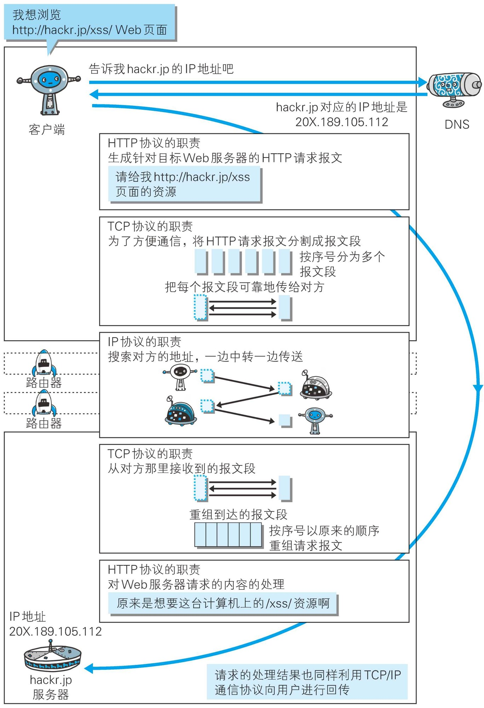

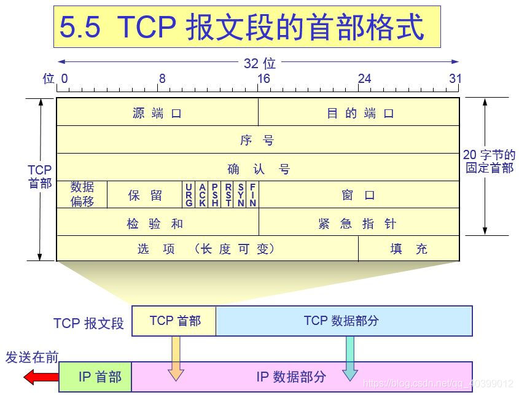

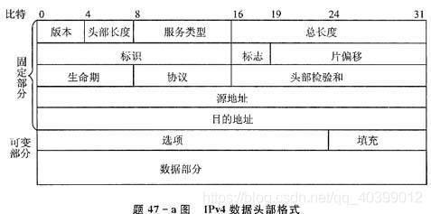

-----

## ⭐TCP

**核心：tcp不允许半打开状态（使得连接时的四次握手变成三次），但是允许半关闭状态**


↑一次连接的简要图


↑Linux内部怎么处理，重点是struct sock的两个队列，**两个队列是tcp能够全双工的关键**


三次握手

### 为什么要三次握手

最核心的原因是为了满足在**信道不可靠**的情况下建立双向连接。

**TCP 协议是不限制一个特定的连接（两端 socket 一样）被重复使用的。**

所以问题实际上是：这条连接突然断开重连后，TCP 怎么样识别之前旧链接重发的包？——这就需要独一无二的  ISN（初始序列号）机制。

> 当一个新连接建立时，`初始序列号（ initial sequence number ISN）生成器`会生成一个新的32位的 ISN。这个生成器会用一个32位长的时钟，差不多`4µs` 增长一次，因此 ISN 会在大约 4.55 小时循环一次

三次握手（A three way handshake）是必须的， 因为 sequence numbers（序列号）没有绑定到整个网络的全局时钟（全部统一使用一个时钟，就可以确定这个包是不是延迟到的）以及 TCPs 可能有不同的机制来选择 ISN（初始序列号）。

--

1. 避免资源浪费
   1. 假如第一次握手时，在时间已经超时后客户端的syn到达了服务器，这时候只有客户端知道超时了但是服务器不知道。
   2. 假设只有两次握手，服务器就会开始连接，发送一个ack，但是此时的客户端对这个旧的syn认为是丢弃了的，不应该建立连接，所以也不会回应服务器的ack。
   3. 所以，最后服务器会阻塞在 **SYN_RCVD** 阶段，也就是阻塞在accpet()内，浪费大量资源。
   4. 或者服务器对重复的SYN会马上开启连接，这样就会浪费大量资源
2. 避免历史连接
   客户端连续发送多次 SYN 建⽴连接的报⽂，在⽹络拥堵情况下：
   1. ⼀个「旧 SYN 报⽂」⽐「最新的 SYN 」 报⽂早到达了服务端；
   2. 那么此时服务端就会回⼀个 SYN + ACK 报⽂给客户端
   3. 客户端收到后可以根据⾃身的上下⽂，判断这是⼀个历史连接（序列号过期或超时），那么客户端就会发送 *RST* 报⽂给服务端，表示中⽌这⼀次连接。
3. 同步双方的初始序列号

补充：

1. 为了减少恶意伪造数据包的用户攻击
2.  减少异常的情况下服务器端的资源占用

### SYN泛洪

TCB（在这里不是进程控制块，是Translate，传输控制块）

试图发送足够多的SYN包而耗尽backlog是TCP  SYN洪泛的目的。

为了避免这种内存耗尽，操作系统通常给监听接口关联了一个"backlog"队列参数，它同时维护连接的TCB上限数量和SYN-RECEIVED状态。

> 尽管这种方案使主机的可用内存免遭攻击，但是backlog队列本身就带来了一个(小的)受攻击源。当backlog中没有空间时，就不可能再响应新的连接请求，除非TCB能被回收或者从SYN-RECIEVE状态中移除。

攻击者在SYN包中加入源IP地址，这样就不会导致主机将已分配的TCB从SYN-RECEVIED状态队列中移除(因为主机将响应SYN-ACK)。

因为TCP是可靠的，目的主机在断开半开连接并在SYN-RECIEVED队列中移除TCB之前将等待相当长的时间。在此期间，服务器将不能响应其他应用程序合法的新TCP连接请求。

1. 如果攻击者用他们自己的没有经过伪装的IP地址快速地发送SYN数据包，这就是所谓的直接攻击。这种攻击非常容易实现，因为它并不涉及攻击者操作系统用户层以下的欺骗或修改数据包。
2. SYN洪泛攻击的另一种方式是IP地址欺骗。它比直接攻击方式更复杂一点，攻击者还必须能够用有效的IP和TCP报文头去替换和重新生成原始IP报文。
    攻击者可以用的一个非常简单的方法，就是仅需伪装一个源IP地址，而这个IP地址将不能响应SYN-ACK包，或许因为这个IP地址上根本就没有主机，或许因为对主机的地址或网络属性进行了某些配置。

#### Server端解决

那么现在的问题就是服务器如何在**不分配**资源的情况下

1. 验证之后可能到达的`ACK`的有效性，保证这是一次完整的握手
2. 获得`SYN`报文中携带的`TCP`选项信息

**增加TCP backlog队列**

由于其基本攻击原理是依赖于终端主机连接套接字的backlog溢出，因此一个显然的基于终端主机的解决方案是增加backlog队列大小，而且这种方法已经广泛的运用于大多数服务器了。

**减少SYN-RECEIVED的时间**

另一个基于终端主机的解决方法是缩短一个TCB从进入SYN-RECEIVED状态到因未进入下一个状态而被回收之间的时间。

但这个方案的一个明显缺点是攻击可以利用因拥塞而丢包的ACK-SYN或者握手完成的ACK包，这样合法连接的TCB就会由于主机忙于重传这些包(因为SYN-RECEIVED时间减少)而被回收。

**SYN Cookies**

`SYN Cookies`算法[wiki](https://link.segmentfault.com/?enc=mwVGCuJ8JiBmYIa17Bp8QA%3D%3D.NugPr2AzcGweZ9YDvBMvXDbjBP8PymxhuqGOEshHX45MRAZbuBMkN6xpvwBpLIf9)可以解决上面的第`1`个问题以及第`2`个问题的一部分

开启了Cookies，就允许服务器在SYN队列被填满的时候避免丢弃链接。服务器会返回SYN+ACK，但是会丢弃SYN队列的TCB（不代表丢弃链接），而当收到客户端随后的ACK相应之后，服务器可以根据编码在TCP Cookies内的信息重构TCB。

`SYN Cookie`技术可以让服务器在收到客户端的`SYN`报文时，不分配资源保存客户端信息，而是将这些信息保存在`SYN+ACK`的初始序号和时间戳中。对正常的连接，这些信息会随着`ACK`报文被带回来

**它本身的实体就是seq number。思想就是以seq为载体，将必要信息编码到序列号里面**

`TCP`连接建立时，双方的起始报文序号是可以**任意**的。`SYN cookies`利用这一点，按照以下规则构造初始序列号：

- 设`t`为一个缓慢增长的时间戳(典型实现是每64s递增一次)
- 设`m`为客户端发送的`SYN`报文中的`MSS`选项值
- 设`s`是连接的元组信息(源IP,目的IP,源端口，目的端口)和`t`经过密码学运算后的`Hash`值，即`s = hash(sip,dip,sport,dport,t)`，`s`的结果取低 **24** 位

则初始序列号`n`为：

- 高 **5** 位为`t mod 32`
- 接下来**3**位为`m`的编码值
- 低 **24** 位为`s`

当客户端收到此`SYN+ACK`报文后，根据`TCP`标准，它会回复`ACK`报文，且报文中`ack = n + 1`，那么在服务器收到它时，将`ack - 1`就可以拿回当初发送的`SYN+ACK`报文中的序号了！服务器巧妙地通过这种方式间接保存了一部分`SYN`报文的信息。

接下来，服务器需要对`ack - 1`这个序号进行检查：

- 将高 **5** 位表示的`t`与当前之间比较，看其到达地时间是否能接受。
- 根据`t`和连接元组重新计算`s`，看是否和低 **24** 一致，若不一致，说明这个报文是被伪造的。
- 解码序号中隐藏的`mss`信息

到此，连接就可以顺利建立了。

`SYN Cookies`**缺点**：

1. `MSS`的编码只有**3**位，因此最多只能使用 **8** 种`MSS`值
2. 服务器必须拒绝客户端`SYN`报文中的其他只在`SYN`和`SYN+ACK`中协商的选项，原因是服务器没有地方可以保存这些选项，比如`Wscale`和`SACK`
3. 增加了密码学运算

**SYN缓存**

在采用SYN缓存的主机中，一个带有被限制大小的HASH表空间被用于存放那些将被分配给TCB的数据的一个子集。

如果当握手完成的ACK接收到了，这些数据将被复制到一个完整的TCB中，否则超出存活时间的HASH值将会在需要时被回收。

---

#### 应用层面解决

**防火墙与代理**

一个有防火墙或者代理的设备在网络中就能够通过两种方法缓冲SYN洪泛攻击，一种是对连接发起人伪装SYN-ACK包，另一种是对服务器伪装ACK包[5]。

防火墙/代理将会停留等待一段时间，如果连接发起人正确的ACK没有被检测到，它将会通过伪装的TCP  RET报文使服务器释放TCB。对合法的连接，数据包流能够在没有防火墙/代理的影响下继续进行。这种方法相比于上面伪装SYN-ACK的方法更具吸引力，因为当合法连接建立以后防火墙/代理不需要直接参与到连接中去。

**活动监视器**

活动监视器是一种能够检测并干预发往服务器的流量的设备，跟像防火墙一样，它并不是网络路由中必须的设备。一种典型的监视器会像7中的ACK伪装的防火墙/代理一样，拥有一个附加的能力，就是如果它发现SYN包来源于它知道的攻击者源地址就会立刻发送伪装RST包给服务器。

---

### 半连接队列和全连接队列

如上文所说，tcp在握手的时候，server主要参与工作的就是两个队列。

补充具体问题分析：https://blog.csdn.net/ptonlix/article/details/76528206

具体地，客户端发送`SYN`包，服务端收到后回复`SYN+ACK`后，服务端进入`SYN_RCVD`状态，这个时候的socket会放到半连接队列。

当服务端收到客户端的ACK后，socket会从半连接队列移出到全连接队列。

当调用accpet函数的时候，会从全连接队列的头部返回可用socket给用户进程。

1. 半连接队列的大小由`/proc/sys/net/ipv4/tcp_max_syn_backlog`控制，Linux的默认是1024。

2. 对于半连接队列，还有一个ack保活计时器，在server回 syn_ack 之后，在server端会开启一个计时器，如果超时（默认60s？**需要看linux设置**）那就会重发 syn_ack 包

3. 重传的次数由`/proc/sys/net/ipv4/tcp_synack_retries`控制，默认是5次。

4. 全连接队列的大小通过`/proc/sys/net/core/somaxconn`指定

5. 在使用listen函数时，内核会根据传入的`backlog`参数与系统参数somaxconn，取二者的较小值。

    ```c
    int listen(int sockfd, int backlog)
    ```

6. Nginx和Redis默认的backlog值等于511，Linux默认的backlog 为 128，Java默认的backlog等于50

**队列满容量之后**

默认情况下，全连接队列满以后，服务端会忽略客户端的 ACK，随后会重传`SYN+ACK`

也可以修改这种行为，这个值由`/proc/sys/net/ipv4/tcp_abort_on_overflow`决定。

- tcp_abort_on_overflow为0表示三次握手最后一步全连接队列满以后服务端会丢掉客户端发过来的ACK，服务端随后会进行重传`SYN+ACK`。
- tcp_abort_on_overflow为1表示全连接队列满以后服务端发送RST给客户端，直接释放资源。

----

## TCP三次握手和四次挥手的异常处理 

链接：https://blog.csdn.net/ArtAndLife/article/details/120004631

## TCP判断宕机

分析：https://www.cnblogs.com/youxin/p/4056041.html

Linux具体情况：https://blog.csdn.net/weixin_48182198/article/details/120455363

------

## ⭐为何 time_wait 状态持续 2msl 而不是 1msl ？


**不管是主动方还是被动方都需要一个FIN、一个ACK来CLOSE**

1. TCPA向TCPB发送结束的FIN报文，变为FIN_WAIT_1，抵达需要 1 个 MSL。
2. TCPB 向 TCPA 发送 Last ACK + FIN，变为CLOSE_WAIT，抵达需要 1 个 MSL。
3. ACK抵达后 TCPA 从 FIN_WAIT_1 变成 FIN_WAIT_2 状态，FIN抵达后 TCPA 从 FIN_WAIT_2 变成 TIME_WAIT 状态，并且返回 ACK 对 TCPB 进行响应，如果一切正常，那么再过 1 个 MSL 之后就会抵达 B。

**分析：**

假如 TCP A 的 ACK 没有抵达 B，那么对于 B 来说，B 发送了一个 Last ACK 出去，处于 CLOSE_WAIT 状态，等待 A 的 ACK 回来，进入到CLOSED

如果 B 在发了 ACK 后过了 2 个 MSL 后没有收到 A 的 ACK ，那么就会重新发这个 FIN 报文。

如果A没有TIME_WAIT，直接进入CLOSED状态，那么B应该收到的A的ACK就不存在，B就会一直重发ACK，而且B永远不会进入CLOSED。

A 等待 **2MSL** 的目的是**在于防止B的Last ACK 在传输过程中丢失**，那么对于 B 来说会在 A 等待 1 个 MSL （这时 B 已经等待了两个  MSL ）后重发报文，这个重发报文过 1MSL 之后内会抵达 A，**所以 A 可以在 2 个 MSL 内确认到 B 是否没有接到自己的 ACK。**

**目的：**

1. 可靠地实现 TCP 全双工连接的终止。（确保最后的 ACK 能让被关闭方接收）；
2. 允许老的重复分节在网络中消逝。
3.  TCP 中是可靠的服务，当数据包丢失会重传，当有数据包迷路的情况下，**如果不等待 2MSL 时，当客户端以同样地方式重新和服务建立连接后，上一次迷路的数据包这时可能会到达服务，这时会造成旧包被重新读取**

---

## ⭐TCP和UDP的区别

TCP是面向流的设计，UDP是面向报文的设计


报文长度：

TCP的动态报文长度，可以根据接收方的窗口大小和当前网络的拥塞情况调整，但因此会出现粘包的情况

UDP面向报文：不合并不拆分

首部开销：

TCP首部20字节

UDP首部8字节：源端口、目的端口、数据长度、检验和

**tcpdump抓包的话 加个 `-v` 即可看到 proto 信息了**

```bash
tcpdump -i eth1 -v  port 53
```

只看 UDP 协议的信息输出：

```bash
tcpdump -i eth1 -vnn udp port 53
```

`-n` 是指不进行 IP 地址到 主机名 的转换。

而 `-nn` 是指不进行端口名称的转换

TCP的数据大小如果大于MSS大小，则会在传输层进行分片，目标主机收到后，也同样在传输层组装TCP数据包，如果中途丢失了一个分片，因为“队头阻塞”设计，只需要传输丢失的这个分片。

UDP的数据大小如果大于MTU(Maximum Transmission Unit)大小，则会在IP层进行分片，目标主机收到后，在IP层组装完数据，接着再传输给传输层，但是如果中途丢了一个分片，在实现可靠传输的UDP时则就需要重传所有的数据包，这样传输效率非常差，所以通常UDP的报文应该小于MTU。

-----

## UDP缺陷/UDP可靠传输设计

参考：https://blog.csdn.net/danscort2000/article/details/8432778

------

## TCP的设计思路 *

TCP作为传统的传输控制协议，诞生在上世纪70年代。最初的需求是一对一的Telnet远端登录。

总的来说，有三个选择

1. 基于单字符的停等协议
    在长RTTI时效率非常糟糕
2. 字符流水化传输的GBN协议
3. 基于块传输的SR协议
    没有能保证按序的操作，所以会乱序，而且对接收端的内存要求很高。

**于是，TCP一开始使用了GBN协议，采取的是累计确认机制，接收方只会重复确认最后一个按序到达的报文段**

后来TCP开发了**SACK机制**，但只能用于SYN报文段。

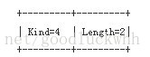它的工作机制类似于窗口扩大选项和事件戳选项

**它使得接收方能告诉发送方哪些报文段丢失，哪些报文段重传，哪些报文段已经提前收到等信息。**
根据这些信息TCP就可以只重传那些真正丢失的报文段。

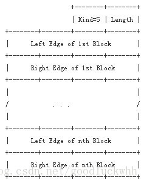

该选项长度可变，但由于整个TCP选项长度不超过40字节，所以实际最多不能超过4组边界值。

1. LeftEdgeofBlock：不连续块的第一个报文段的序列号
2. RightEdgeofBlock：不连续块的最后一个报文段的序列号之后的序列号。

参考：https://blog.csdn.net/goodluckwhh/article/details/10220999

这是一种SR思想的机制，但由于option里的SACK数量是有限制的，所以TCP并没有实现严格的SR。

随后为了应付互联网的拥塞，为了提高带宽利用率，开始出现各种拥塞算法。

**但是TCP的GBN就决定了TCP是适合串行字符传输的，不适合块传输，这也导致了TCP的大文件传输性能非常不佳**

有很多人把TCP的性能消耗归咎于握手消耗，按序消耗，确认消耗。但是这些都是小毛病。

虽然在短连接中，0-RTT势在必行，但是在长连接中握手开销实际可以忽略，此外保序性是由传输的内容决定的，这样无关协议，就算TCP不保序，应用层也应该要保序。

**所以问题出在传输本身**

1. 是在传输过程保序，还是接受过程保序
2. 是在传输过程中保持连接，还是在应用程序中保持连接
3. 连接的目标是一个服务还是一个地址

**TCP把传输内容的属性和传输协议进行了强绑定**，这才是问题的根源。

1. 队头拥塞问题，由于TCP采用了GBN，只要有一个数据包丢失，那么接收滑动窗口就会塞住，直到整个空洞被补上。

2. 移动问题，TCP把连接和TCP四元组进行了强绑定，只要有一个因素变了，连接就变了。但是IP标识的是一个网络接口的位置，这就导致了TCP不能支持IP地址的漂移。

    > 在分配IP地址时，要分清工作IP地址和主机自有地址。如在主从方式、单网卡的情况下，主机一地址为200.10.10.1,主机二的地址为200.10.10.2,工作地址为200.10.10.3,正常情况下，工作主机的自有地址是被工作地址取代的（若主机一在工作，主机一的地址由200.10.10.1变为200.10.10.3）。在发生主机切换的情况下，主机一的地址恢复为200.10.10.1，而主机二的地址会由200.10.10.2变为200.10.10.3，这就是地址漂移 

3. 组播问题，TCP端口号本身就是同一台计算机内部端到端的传输，控制多路复用的产物，所以TCP无法支持一对多的传输。

**此外，TCP还有以下缺点**

1. TCP破坏了IP网络的节点对等性。**TCP的连接保持使得一条流很容易被识别**，我们只需要解析协议头就可以了，这催生了各种中间NAT设备和中间防火墙的出现，但是这就导致了连接双方的网络不对等，中间可能会掺杂各种代理服务器。
2. 拥塞控制问题。这是1988年提出的手段。**原始的GBN设计留给“如何重传”太多的操作空间，而“如何重传”这件事情又直接取决于“如何判断丢包”，这就导致了大量拥塞控制算法的出现。**
    虽然后来的SACK缓解了丢包的误判导致的重传，但是本质并没有变化，特别是随着带宽的变大，SACK的限制会越来越明显。
3. 流控算法的缺陷：https://www.zhihu.com/question/47560918/answer/234698413

**QUIC取代TCP很难，因为TCP的历史包袱太重。**

几乎所有的有状态防火墙，状态NAT设计，负载均衡设备，均完全依赖TCP的状态机，如果换成QUIC，这些设备将一夜之间全部失效！

---

## TCP保证可靠性

1. 序列号、确认应答、超时重传
   如果发送发迟迟未收到确认应答，那么可能是发送的数据丢失，也可能是确认应答丢失，这时发送方在等待一定时间后会进行重传。**这个时间一般是2*RTT(报文段往返时间）+一个偏差值。** 
2. 窗口控制+快速重传
3. 拥塞控制
   慢启动：指数函数
   拥塞避免：达到慢启动阈值，线性增长

------

## TCP不能保证应用层的可靠

解决：在应用层再加一个ack包，只收到了TCP-fin包但没收到应用ack包，就说明发完fin之后server就宕机了

------

## TCP故障

不能收到fin包的故障：如果是**客户端掉线了导致服务器阻塞在epoll上面**，可以让客户端做心跳包定期发送心跳信息，如果心跳没了就说明可以删掉对应的socket而不用继续阻塞了。

### 粘包

在接收方的缓存区，后一包数据的头紧挨着前一包数据的尾部，**但因为TCP面向流的哲学，粘包处有可能被同时取走成为同一结构而造成错解析的情况。**

而UDP是面向报文的，有保护消息边界，不存在粘包。

**可能的原因**

1. 发送方使用的Nagle算法，主要目的是**减少网络中传输的报文段的数量**
   1. 只有上一个分组得到确认。才会发送下一个分组
   2. 收集多个小分组，在一个确认到来的时候可以全部发送
2. 接收方
   1. 接收到数据包不立刻交由应用层处理，而是先放进缓存。**如果TCP接受数据包到缓存的速度大于应用程序从缓存中读取数据包的速度，就会造成多个包被缓存并粘包的情况**

**如果多个分组在逻辑上毫无关联，就必须处理粘包情况**

**解决**

1. 发送方关闭Nagle算法，socket使用TCP_NODELAY关闭
3. 应用层（接收方传输层没办法处理粘包，只能由双方应用层处理）
   循环处理，读完一条数据的时候应该循环读取下一条数据，直到所有数据被读取完成。总的来说有两个设计原则
   1. 格式化数据：要确保每条数据有固定格式，而且数据内部不含有对应的分隔符
   2. 发送长度：发送每条数据的时候将数据长度一起发送。

### 追问：TCP真的存在粘包吗

A：TCP粘包这个说法确实不准确，因为TCP是字节流协议，本身就没有包的概念，包是应用层的概念，问题的产生场所也是传输层-应用层，**编写拆包逻辑也是应用层的工作**。

### TCP之Nagle算法&&延迟ACK

链接：https://blog.csdn.net/weixin_30849591/article/details/97379243

### TCP连接过程的物理链接断开重连

知乎：https://www.zhihu.com/question/53672815?from=profile_question_card

TCP是虚拟连接，如果[低层物理链路](https://www.zhihu.com/search?q=低层物理链路&search_source=Entity&hybrid_search_source=Entity&hybrid_search_extra={"sourceType"%3A"answer"%2C"sourceId"%3A136153506})断开，只要不引起keepalive retry timeout，TCP连接会一直健在。

------

## ⭐HTTPS

HTTP本身的用明文传输的，不安全。

HTTPS == HTTP+SSL(TSL)。

HTTP报文经过SSL层加密之后交付给TCP层进行传输。SSL（安全套接层）主要采用的是RSA和AES结合的加密方式。

先通过RSA加密 加密AES的密钥，然后通过AES进行报文的加密和解密。

机密性+完整新完整描述：https://www.cnblogs.com/rickiyang/p/13218088.html#1568539772

### SSL加密

SSL的加密过程是RSA混合AES的。

Q：为什么

A：非对称加密运算速度慢

client端

1. server端生成RSA公钥和私钥对，通过api将公钥返回给client端
2. client端自己生成AES密钥--aeskey
3. client端利用aeskey加密明文json数据，得到请求数据encryptData
4. client端使用RSA公钥加密AES密钥aeskey，得到encryptAesData
5. clinet端将encryptAesData作为请求头，encryptData作为请求体，发送到server端

server端

1. 收到请求后，通过请求头得到encryptAesData，RSA私钥解密后得到aeskey
2. .通过请求体得到encryptData，然后用aeskey解密，得到明文data类型
3. data转换成json格式进行后续处理

#### RSA原理

解密证明：https://cjting.me/2020/03/13/rsa/

非对称加密运算速度慢

在配置 GitHub 或者 远程服务器时，一般我们都会使用 `ssh-keygen` 生成秘钥，然后上传 `id_rsa.pub` 到远程服务器，这样，之后的访问便不再需要输入密码，十分方便，同时也十分安全。

这里的 `ssh-keygen` 生成的就是 RSA 的两把钥匙。访问远程服务器和拉取 Git 仓库这些常见操作底层都是在使用 RSA 进行鉴权

RSA的加密过程


被加密的明文m 需要是一个小于 n 的整数（我们可以将任意字节流直接解读为一个无符号整数）。如果消息太大，解读为整数以后比 n  要大，那么分段加密即可。实际上在工程中，我们不会直接用 RSA 来加密消息，而是用 RSA 来加密一个对称秘钥，再用这个秘钥加密消息。

解密


**N：**

准备两个互质数p，q。这两个数不能太小，太小则会容易破解，将p乘以q就是N。如果互质数p和q足够大，那么根据目前的计算机技术和其他工具，至今也没能从N分解出p和q。换句话说，只要密钥长度N足够大（一般1024足矣），基本上不可能从公钥信息推出私钥信息。

**L：**

L 是 p－1 和 q－1的最小公倍数，可用如下表达式表示

> L = lcm（p－1，q－1）

**E：**

E必须满足两个条件：E是一个比1大比L小的数，E和L的最大公约数为1；

用gcd(X,Y)来表示X，Y的最大公约数则E条件如下：

```
1 < E < L

gcd（E，L）=1
```

之所以需要E和L的最大公约数为1，是为了保证一定存在解密时需要使用的数D。现在我们已经求出了E和N也就是说我们已经生成了密钥对中的公钥了。

Q：因为 n 是公开的，所以私钥的安全本质上就是 d 的安全，那么有没有可能在得知 n 和 e 的情况下，推导得出 d？

A：不能，d 的安全性依赖于对 n 进行质数分解的难度。目前来说，大整数的质数分解是一件相当困难的事情，参考 [整数分解](https://zh.wikipedia.org/wiki/整数分解)。

---

#### AES原理

给定一个 128 位的明文和一个 128 位的密钥，输出一个 128 位的密文。

这个密文可以用相同的密钥解密。虽然 AES 一次只能加密 16 个字节，但我们只需要把明文划分成每 16 个字节一组的块，就可以实现任意长度明文的加密。如果明文长度不是 16 个字节的倍数，则需要填充，目前填充方式主要是 PKCS7 / PKCS5。

太复杂了，详细介绍：https://www.jianshu.com/p/8ebe87949e20

主要流程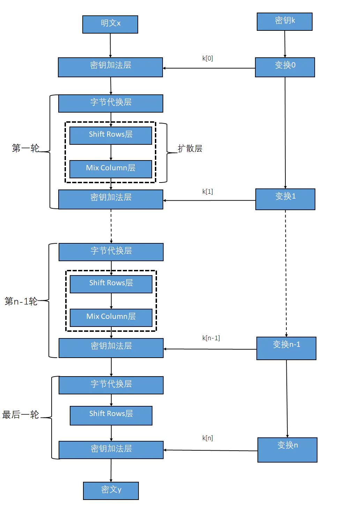

### 摘要算法、CA证书

完整描述：https://www.cnblogs.com/rickiyang/p/13218088.html

摘要算法的验证，发生在得到明文之后

实现完整性的手段主要是 **摘要算法**（Digest Algorithm），也就是常说的散列函数、哈希函数（Hash Function）。

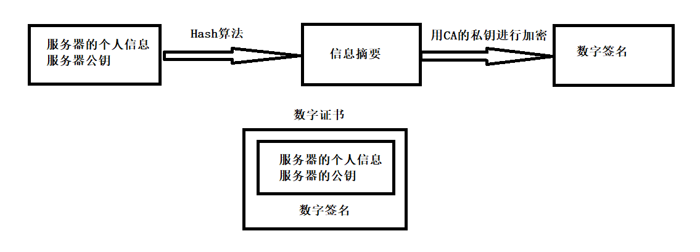

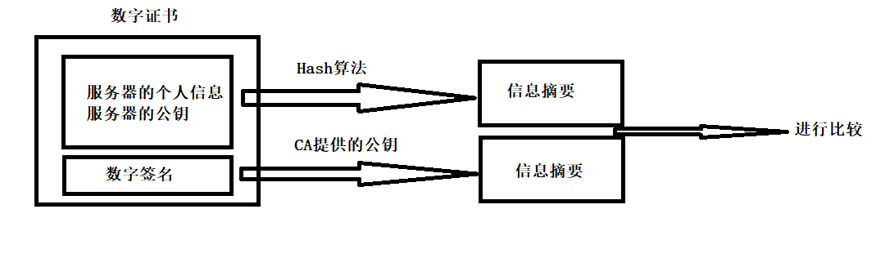

数字证书 == （服务器个人信息+服务器公钥） + 数字签名。

拿到数字证书之后，对服务器信息进行 hash 得到中间部分的信息摘要。

对数字签名进行公钥解密得到中间部分的信息摘要。

如果信息在中途被修改，那么两份信息摘要就不可能相同。

---


------

## HTTP和HTTPS的不同

1. HTTP是明文传输，HTTPS是经过SSL/TLS加密的
2. HTTPS在TCP三次握手阶段之后，还需要进行SSL的handshake
3. HTTPS需要服务端安装证书
4. HTTP的协议端口一般是80和8080，HTTPS端口一般是443

-----

## HTTPS缺点

1. 握手阶段存在延迟
2. 部署成本高，需要购买CA证书
3. 额外的CPU计算，需要CPU进行加解密的计算。

---

## Q：如何使HTTPS比HTTP快

A：这是不可能完成的任务。

> And math says if you do X and then add on Y you get Z, and Z will always be greater than X or Y.
>
> ——LORI MACVITTIE

**Q：为什么会有上述的说法**

A：偷换概念，把强制安全的HTTP2等同于HTTPS。而**HTTP2通过在同一TCP连接上并行运行更多请求来最大化设备带宽**，所以速度会碾压HTTP1.1，即使在此基础上强制加上TSL/SSL安全套接层，速度也不会太慢。**但是这并不意味着HTTPS比HTTP快**。而且HTTP2也可以进行不安全的HTTP传输。

> 比较安全的HTTP2和不安全的HTTP2将会是困难的，即使不是不可能的。尽管HTTP2可以放弃仅对安全连接的要求并允许使用纯文本，**但所有主流浏览器均拒绝支持纯文本**，并且到目前为止仅提供了对基于TLS / SSL的HTTP 2的支持。甚至诸如curl之类的流行命令行工具都拒绝允许不安全的HTTP2连接。

**Q：如何加快HTTPS的速度**

A：

1. 将网站从HTTPS协议升级为HTTP2协议
    HTTP2的主要特性https://blog.csdn.net/yexudengzhidao/article/details/98207149
    1. 多路复用
    2. “智能”标头 ‘smart’ headers,
    3. 二进制比特流传输
2. 使用Service workers。**网站可以利用Service Worker来更快地下载资源以及获得脱机支持。** Service Workers不会为初次使用的用户带来性能提升，但是经常访问该网站的用户将获得性能提升。

---

## HTTP长连接和WebSocket长连接的区别

来源：https://blog.csdn.net/eleanoryss/article/details/109600154

**首先需要消除一个误解：HTTP协议是基于请求/响应模式的，因此客户端请求后只要服务端给了关闭响应，本次HTTP请求就结束了，没有长连接这一说。那么自然也就没有短连接这一说了。**

所谓的HTTP分为长连接和短连接，其实本质上是说的TCP连接。TCP连接是一个双向的[通道](https://so.csdn.net/so/search?q=通道&spm=1001.2101.3001.7020)，它是可以保持一段时间不关闭的，因此TCP连接才有真正的长连接和短连接这一说。

----

## HTTP2主动推送

来源：https://blog.csdn.net/qq_38937634/article/details/111413823

1.服务器推送的意义

- 提前将资源推送到浏览器
- 推送可以基于已发送的请求，例如客户端请求 html，服务端可以主动推送 js、css 文件

2.服务端推送的基本实现原理

- 推送资源必须对应一个请求
- 请求由服务端 PUSH_PROMISE 帧发送
- 响应在 Stream ID 的 Stream 中发送，并且服务产生的 Stream ID 是偶数


-----

## 如何解析HTTP报文

元戎：稍微说到了

参考：https://www.cnblogs.com/hoohack/p/6037365.html

实际上是在考察http报文格式

A：以\r\n为标识解析出每一行，然后对每一行再进行解析，当解析到空行的时候，就 将后面的文本作为数据对待

报文由三个部分组成：

> - 对报文进行描述的起始行
> - 包含属性的首部块
> - 可选的、包含数据的主体部分

### 解析思想

遍历recv接受到的请求字符串，检查是否遇到回车符**\r**判断一行数据。

对于起始行，检查是否遇到空格分隔不同的字段；

对于首部，检查是否遇到冒号分隔键值对的字段值；

对于实体的主体部分，则先判断是否遇到CRLF字符串，然后将剩余内容全部作为实体的主体部分。

返回值是告知程序下一次遍历的起始位置。

如果遇到非法请求行则返回400的响应。


---

## HTTP缓存

浏览器向服务器请求数据的时候，发送请求报文。

服务器向浏览器返回数据的时候，返回响应报文。

1. 首行：请求方法，HTTP协议版本，状态码，状态码描述
2. 头部：key-value键值对，用以存储记录，数据长度，数据类型，是否缓存，数据是否匹配等。
3. 空行：分割首部和正文。
4. 主体：传输数据的地方。

缓存规则大致分为两类： **强制缓存** 和 **对比缓存** 。

第一次请求的时候，服务器返回缓存数据和缓存规则，包含在**header**中。

如果命中 **缓存数据标识** ，强制缓存就不会请求服务器，在 **缓存时间** 内下次请求直接使用缓存，如果超过了时间就执行比较缓存策略。

客户端在请求一个文件的时候，发现自己缓存的文件有 Last Modified ，那么在请求中会包含 If Modified Since 时间，这个时间就是缓存文件的 Last Modified 。**服务端只要判断这个时间和当前请求的文件的修改时间就可以确定是返回 304 还是 200 。**

**对比缓存会把标识发给服务器，由服务器决定是否使用，如果返回304状态码，则可以使用本地缓存数据。如果返回200则代表重新获取的数据**

---

## HTTP返回码

- 1xx：指示信息，表示请求已接受
- 2xx：成功
- 3xx：重定向
- 4xx：客户端错误，请求有语法错误之类的
- 5xx：服务器错误

**常见：**

- 200：ok
- 301：永久重定向
- 302：临时重定向
- 403：服务器能收到请求，但是拒绝服务
- 404：请求的资源不存在

### 302和303的区别

实际问题（页面组合上使用了iframe）：https://www.cnblogs.com/dingzhaoming/p/8628507.html

参考：https://www.zhihu.com/question/268485682

简单说就是http 1.0里面302具有二义性，在http 1.1中加入303和307就是为了消除二义性。

- 在HTTP 1.0的时候，302的规范是原请求是post不可以自动重定向，但是服务器和浏览器的实现是运行重定向。
- 把HTTP 1.0规范中302的规范和实现拆分开，分别赋予HTTP 1.1中303和307，因此在HTTP 1.1中，303继承了HTTP 1.0中302的实现（即原请求是post，也允许自动进行重定向，结果是无论原请求是get还是post，都可以自动进行重定向），而307则继承了HTTP 1.0中302的规范（即如果原请求是post，则不允许进行自动重定向，结果是post不重定向，get可以自动重定向）。

---

## ⭐经典：浏览器输入URL

1. 元戎：变形，问爬虫过程，需要结合scrapy和调度器回答

    1. 输入URL，浏览器要将URL解析为IP地址，**DNS协议**
        1. 本地查询有没有对应的DNS缓存，有就直接找到了
        2. 没有，本地的DNS服务器向根域名服务器发送查询请求，迭代查询/递归查询
        3. 根域名服务器->一级域名服务器->二级域名服务器，**UDP协议**
    2. 取得IP地址，浏览器（客户端）需要和服务器建立http连接，**HTTP/HTTPS协议**
        1. http生成一个get请求报文，**HTTPS协议**加密数据，交给TCP层
        2. **TCP协议**对数据进行分片（依据MTU和MSS）
        3. TCP数据包发给IP层，**IP协议**进行路由选路想办法到达。
        4. 到达某个网段，需要寻址，需要 **以太网协议**，以太网规定了连入网络的所有设备都必须具备**“网卡”接口**，数据包都是从一块网卡传递到另一块网卡，网卡的地址就是 Mac 地址。
        5. **以太网协议**需要目的IP的MAC地址，获取目的IP的MAC地址需要 **ARP协议**
    3. 数据进入了服务器的网卡，开始处理请求
        1. 通常需要先跑HTTPD，有 Linux 上常用的 **Apache 和 Nginx**，以及 Windows 上的 **IIS**，然后开启一个子进程去处理、
        2. 接受TCP报文，对连接进行处理，对HTTPS协议进行解析
            - 验证是否配置虚拟主机
            - 验证虚拟主机是否接受此方法
            - 验证该用户是否可以使用该方法（根据ip、身份信息）
        3. 后端处理
        4. 返回相应资源
    4. 资源返回到浏览器，浏览器先分析
        1. 查看Response header，根据不同状态码做不同的事
        2. 如果资源进行了压缩，那么还需要解压
        3. 缓存部分资源
    5. 开始渲染页面
        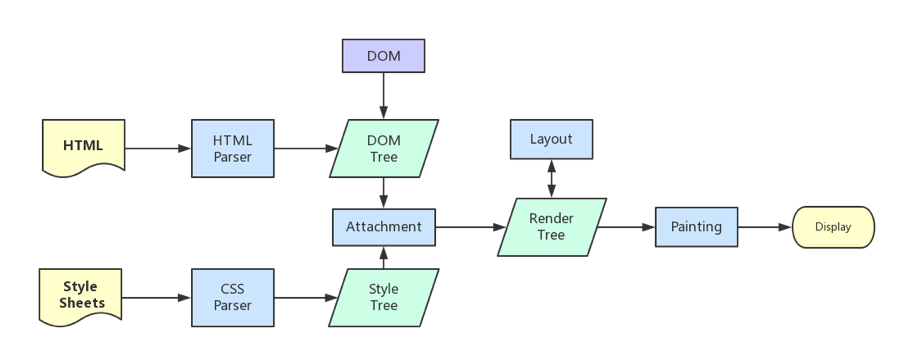
        1. 解析HTML，构建DOM树
        2. 解析CSS，生成CSS规则树
        3. 合并DOM和CSS，生成render树
        4. 布局render树（Layout/reflow），负责元素尺寸、位置
        5. 绘制render，绘制页面像素
        6. 将各层信息发送给GPU，GPU将各层合成
    6. 四次挥手关闭连接（长连接）

---

## ⭐Socket使用

### TCP的socket

 服务端：socket-bind-listen-accept 

 客户端：socket-connect

收发数据，用send()和recv()，或read()和write() 


### UDP的socket


---

## server端监听端口没有客户端连接

问：此时进程状态是什么

如果是最朴素的模型，那就是阻塞

如果使用了io复用之类的模型，就会处于运行

---

## ⭐GET和POST的区别

先说RFC角度（Request For Comments）上的区别

GET和POST本质上都是tcp连接

1. GET一个tcp包，浏览器会把header和data一起发送；POST两个tcp包，分开发送，服务器先响应100 continue，再响应200 ok；
    1. HTTP 协议中没有明确说明 POST 会产生两个 TCP 数据包，而且实际测试(Chrome)发现，header 和 body 不会分开发送。
    2. header 和 body 分开发送是部分浏览器或框架的请求方法，不属于 post 必然行为。

2. GET参数通过url传输；POST放在request body
3. GET参数有长度限制通常是255个字符；POST也有限制但是很大。
    1. 服务器是因为处理长 URL 要消耗比较多的资源，为了性能和安全（防止恶意构造长 URL 来攻击）考虑

4. GET更不安全；因为参数直接暴露
5. GET请求通常是可缓存的；POST请求几乎不可缓存。
6. GET参数保留在Web浏览器的历史记录中；POST不会。
7. GET编码类型是/x-www-form-urlencoded；POST是multipart/form-data 或 application/x-www-form-urlencoded 对二进制数据使用多部分编码。
8. GET只允许使用 ASCII 字符；POST无限制，也允许二进制数据。

### GET优缺点

**优点**

1. 可以检索由 request-URL（统一资源标识符）标识的信息。
2. 能够保存 HTML 表单的结果。
3. 性能更好，因为在URL中附加值是很简单的。

**缺点**

1. 不能发送word文档或者图像。
2. GET只能用于检索数据。
3. 不能传递敏感信息（是使用方面的不能，不是原理方面的不能）
4. URL的长度有限

### POST优缺点

**优点**

1. 使用位置标头指定新的资源位置标头非常容易。
2. 是一种安全方法，因为它的请求不会保留在浏览器历史记录中。
3. 传输大量数据。
4. 发送二进制和 ASCII 数据。

**缺点**

1. 与许多防火墙设置不兼容。（现代应该问题不大了）
2. 不能使用空格、制表符等。
3. 上传大型二进制文件时，POST 方法需要大量时间。

安全？按照网上大部分文章的解释，POST 比 GET 安全，因为数据在地址栏上不可见。

**从传输的角度来说，他们都是不安全的，因为 HTTP 在网络上是明文传输的，只要在网络节点上捉包，就能完整地获取数据报文。**

要想安全传输，就只有加密，也就是 HTTPS。

-----

### 报文上的区别

而如果不讨论RFC上的区别，其实还可以单纯从数据角度上谈。

在数据角度上，**GET和POST没有本质区别**，只是报文格式不一样。

GET 和 POST 只是 HTTP 协议中两种请求方式，而 HTTP 协议是基于 TCP/IP 的应用层协议，无论 GET 还是 POST，用的都是同一个传输层协议，所以在传输上，没有区别。

报文格式上，不带参数时，最大区别就是第一行方法名不同

POST方法请求报文第一行 `POST /uri HTTP/1.1 \r\n`

GET方法请求报文第一行 `GET /uri HTTP/1.1 \r\n`

带参数时

在约定中，GET 方法的参数应该放在 url 中，POST 方法参数应该放在 body 中

GET 方法简约版报文是这样的

```javascript
GET /index.php?name=r0&age=22 HTTP/1.1
Host: localhost
```

POST 方法简约版报文是这样的

```javascript
POST /index.php HTTP/1.1
Host: localhost
Content-Type: application/x-www-form-urlencoded

name=r0&age=22
```

两种方法本质上是 TCP 连接，没有差别，也就是说，如果不按规范来也是可以的。

我们可以在 URL 上写参数，然后方法使用 POST；也可以在 Body 写参数，然后方法使用 GET。当然，这需要服务端支持。

### 服务器端处理的差异

原则上，提交的表单数据的处理取决于它是使用*METHOD="GET"*还是*METHOD="POST"*发送的。由于数据以不同的方式编码，因此需要不同的解码机制。

例如，当[使用 CGI 接口时，脚本在使用](http://hoohoo.ncsa.uiuc.edu/cgi/forms.html)*GET*时会接收环境变量 (QUERYSTRING) 中的数据。

但是当使用POST时，表单数据在标准输入流 ( *stdin* ) 中传递，并且要读取的字节数由 Content-length 标头给出。

### 使用时机

HTTP 协议将 GET 类型的请求定义为[幂等](https://stackoverflow.com/questions/1077412/what-is-an-idempotent-operation)，而 POST 可能有副作用。用简单的英语来说，这意味着 GET 用于查看某些内容，而不更改它，而 POST 用于更改某些内容。

> 使用 HTTP 协议的服务的作者不应该使用基于 GET 的表单来提交敏感数据，因为这将导致该数据被编码在 Request-URI 中。许多现有的服务器、代理和用户代理会将请求 URI 记录在第三方可能看到的某个地方。服务器可以改用基于 POST 的表单提交

---

## 链路层的交互过程

网络层等到  **数据链路层用mac地址作为通信目标，数据包到达网络层准备往数据链路层发送**  的时候

首先会去自己的arp缓存表(存着ip-mac对应关系)，去查找目标ip的mac地址

如果查到了，就将目标ip的mac地址封装到**链路层数据包的包头。**

如果缓存中没有找到，会发起一个广播：who is ip XXX tell ip  XXX,
所有收到的广播的机器看这个ip是不是自己的。

收到广播的主机发现是自己的，则以**单拨的形式**将自己的mac地址回复给请求的机器 

----

## 正向代理和反向代理

客户端无法直接跟服务端发起请求的时候，就需要代理服务。代理可以实现客户端与服务端之间的通信,我们的Nginx也可以实现相应的代理服务。

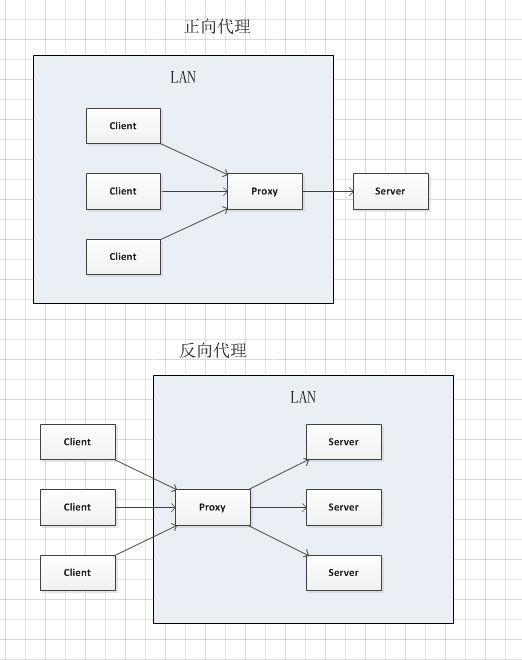

**正向代理**

1. 突破访问限制，比如VPN
2. 提高访问速度，可以在代理服务器设置一个较大的硬盘缓冲区，**然后把部分请求的响应暂时保存在代理服务器的缓存区中**，之后就可以直接由缓冲区取出信息以提高访问速度。
3. 隐藏客户端的真实IP


**反向代理**

1. 负载均衡，根据情况将客户端请求分发到不同的真实的物理服务器上。
2. 提高访问速度，反向代理服务器可以对于静态内容提供缓存服务。
3. 隐藏服务器真实IP
4. 可以作为应用层防火墙，为网站提供对基于Web的攻击行为（比如DDoS）的防护行为。
5. SSL终端代理，为后端服务器统一提供加密和SSL加速。只需要在代理处执行SSL，验证通过之后后续的众多服务器都不需要再进行验证。

应用：https://www.jianshu.com/p/ae76c223c6ef

---

## DNS劫持和HTTP劫持 *

**DNS劫持**

用户上网的DNS都是运营商分配的，DNS劫持后会返回一个运营商的中间服务器IP。

这个动作发生在Http请求发送的时候，运营商劫持http请求之后并不是完全丢弃，而且做了复制，一份继续发给目标服务器，另外一份做劫持处理直接返回302。**因为302返回的会比目标服务器正常返回的要早得多，所以用户浏览器会只认第一个302，后续的返回包会被丢弃。**

而302会重定向到一个处理好的带广告的网页。

**Http劫持**

同样是劫持内容，在运营商的路由节点上设置协议劫持，一旦发现是http请求，而且是html类型的请求，则拦截。拦截后一种是类似DNS劫持一样返回302让用户重定向到其他地址，还有一种是在返回的html数据中插入js或DOM节点，以达到植入广告的效果。

### 处理方法

1. 用 js 对外网进行检测，上报被劫持的情况

    ```js
    window.addEventListener('DOMNodeInserted', checkDivHijack);    
    function checkDivHijack(e) {
            var html = e ? (e.srcElement.outerHTML || e.srcElement.wholeText) : $('html').html();
            var reg = /http:\/\/([^\/]+)\//g;
            var urlList = html.match(reg);
            if (!urlList || urlList.length == 0) {
                return;
            }
            reg = /^http:\/\/(.*\.qq\.com|.*\.gtimg\.cn|.*\.qlogo\.cn|.*\.qpic\.cn|.*\.wanggou\.com)\/$/;
            var hijack = false;
            for (var i = 0; i < urlList.length; i++) {
                if (!reg.test(urlList[i])) {
                    hijack = true;
                    break;
                }
            }
    }
    ```

    **后来发现这个方法检查虽然很彻底，但是如果后续如果有其他业务的正常额外插入也会被误报。**

2. 针对iframe加载的情况，既然302后的页面iframe中的原网页能正常显示，**则说明在请求的url或者cookie上有运营商做的标记，可以利用这个规则，具体情况具体分析。**

3. 针对注入dom节点的情况，初始化的时候检查一次，后续dom注入也作检查，主要是检查dom中是否含有白名单之外的http连接。

4. 其他

    1. 终端拦截所有返回包，直接抛弃第一个返回包以接受后续的正常返回，
    2. 终端拦截请求包，运营商一般判断是否做劫持的时候需要判断是否http请求，一般只会检查tcp连接建立之后的第一个数据包，如果是一个完整的http协议才会被标记。
        所以，只要把请求包切得足够细就能躲过一部分劫持。不过运营商同样可以做多包拦截，国内的“墙”就是这个原理。

---

## DNS加密 *

DNS加密就是DNS服务器返回IP地址的时候加密

类型

1. DNS-over-TLS (DoT) 通过853端口传输（安全性不好）
2. DNS-over-HTTP (DoH) 通过HTTPS加密传输（主流）
3. DNS-over-DTLS
4. DNSCrypt 用起来麻烦
5. DNS-over-HTTPS (代理使用proxied)
6. DNS-over-QUIC
7. DNSCurve

一些著名的DNS服务商已经推出了免费DoH加密服务，首先你需要从DNS服务商获得一串地址，如谷歌的DoH加密服务。

PS：个人网站开发中曾使用过 红鱼DNS 作为查询服务器。

---

## ⭐HTTP3(QUIC)

***HTTP/3*** ：https://daniel.haxx.se/blog/2018/11/11/http-3/

参考：https://www.mobibrw.com/2020/23190


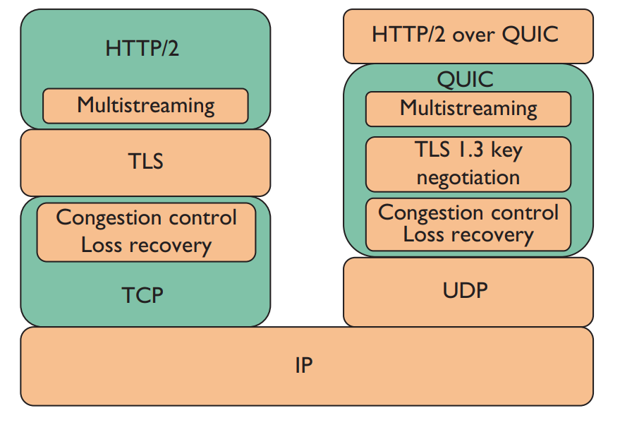
QUIC能针对解决原始TCP的问题

1. 队头阻塞问题，HTTP/2在使用TCP时，其队头拥塞问题已经成了HTTP/2的Stream机制的严重阻碍，因为TCP是在传输过程中保序的。**但是QUIC是在应用程序接收过程中保序**。
2. 移动问题（地址漂移问题）。QUIC不再采用IP地址和端口来标识连接，使用 QUIC Connection ID 调度，这便可以支持IP地址和端口的任意漂移。
    而且TCP是在传输过程中保持连接，QUIC是在应用程序中保持连接。
3. 组播问题。虽然QUIC没有声称支持组播，但是QUIC是一个IP/UDP对，该地址对如何解释，是解释为一个应用程序还是一组应用程序都可以。

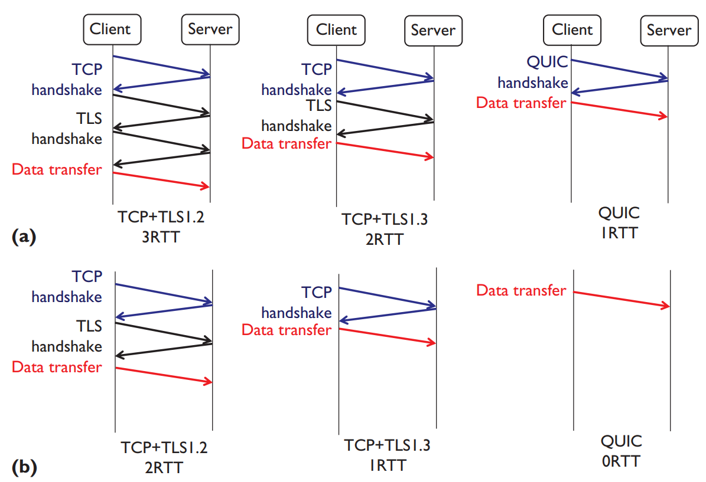

总结：

1. 链接耗时更短
2. 拥塞控制更出色
3. 更好的多路复用
4. 前向纠错特性
5. 链接迁移特性

### QUIC也安全

HTTPS的TLS握手的一个主要目的在于约定一个对称秘钥，用于之后的数据传输。QUIC在这一步用了经典的秘钥加密算法（DH算法）来实现对称秘钥的交换

**其巧妙之处在于，在算出对称秘钥的三个因子中，Client因子b是本地随机产生的，其不用参与网络传输，这就断绝了被第三方劫持的可能性。**


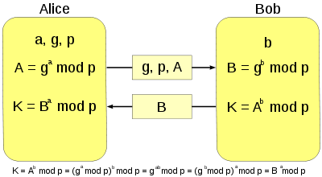

如果p、g是大数，那么即使全部截获到了p、g、A、B，要破解出a、b也是难的。**而且秘钥的随机性是服务器和客户端共同保证的，保证了真随机性。**

握手过程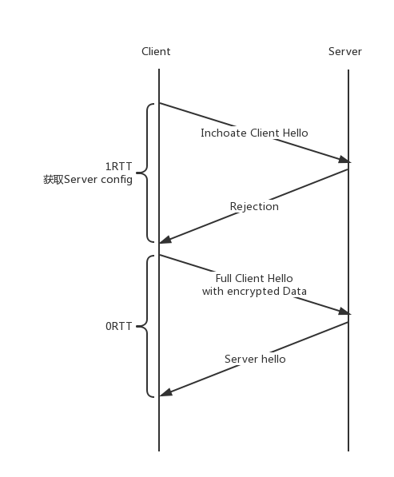

1. 客户端发送inchoate Client Hello消息（CHLO）请求建立连接
    1. **服务器生成一组质数p以及其原根g。**
    2. 根据p、g和随机生成数a算出A
    3. 将A、p、g放在serverConfig里面
    4. 发到Rejection消息（REJ）到客户端；
2. 客户端解析serverConfig
    1. 客户端随机生成一个数b
    2. 根据serverConfig里面的p、A和b算出**初始密钥K**
    3. 将B和用初始密钥加密的Data数据发到（full client hello消息）服务器。
3. 服务器收到客户端的数据
    1. 用客户端发来的公开数B+server config生成同样的秘钥
    2. 解密客户端发来的数据
    3. 发送Server hello消息（SHLO），这时会带上自己生成的**服务器公开数**（服务器这是在更新自己的私钥，实际上这就是为了**保证前向安全性**
4. 客户端收到这个服务器公开数后，二者便更新了秘钥，用SHA-256等算法推导出**会话密钥**。

**后续的连接，如果客户端本地的serverConfig没过期（包含了Apg和其他前次协商信息），直接可以计算出初始秘钥K并加密传输数据，实现0RTT握手。**

**0RTT 能实现的关键是 ServerConfig。就像 TLS session resume 实现的关键是 session id 或者 session ticket 一样。**

ServerConfig 到达服务端后，我们根据 ServerConfig ID 查找本地内存，如果找到了，即认为这个数据是可信的，能够完成 0RTT 握手。

---

### QUIC增强应用（腾讯）

参考：https://cloud.tencent.com/developer/article/1017222

DEMO：https://github.com/tencentyun/clb-quic-demo

腾讯安全云网关 (STGW) 和腾讯云负载均衡器（Cloud Load Balance）在 2017 年 7 月份就已经在服务端上支持了 Quic 协议

应用业务：QQ黄钻业务，QQ会员业务，QQ 空间、WEB 游戏页面、腾讯云 CLB 上灰度支持了 QUIC 协议

STGW优点:

1. 高性能
    - 复用Nginx全异步事件驱动框架
    - 私钥代理计算集群加速签名计算
    - 全局缓存提速
2. 功能性增强
    - 支持Nginx现有全部模块指令
    - 复用Nginx模块框架

**提升0RTT成功率**

安全传输层虽然能够实现 0RTT，优势非常明显。但问题是，不是每一次连接都能实现 0RTT。

**0RTT 能实现的关键是 ServerConfig。就像 TLS session resume 实现的关键是 session id 或者 session ticket 一样。**

但有两个问题

1. 进程之间id无法共享
2. 多台服务器之间id无法共享

**工程层面就需要实现多进程共享及分布式多集群的 ID 共享。**

STGW在生成 ServerConfig ID 和内容时，会存储到全局的 Cache 集群。用户握手请求落到任意一台 STGW 机器，从全局 Cache 集群都能找到相应的内容，实现 0RTT 握手。

**加密性能的优化**

**签名计算**

QUIC 实现 0RTT 的前提是 ServerConfig 这个内容签名和校验都没有问题。由于 ServerConfig 涉及到 RSA  签名或者 ECDSA 签名，非常消耗 CPU 资源

那如何优化呢？**使用 RSA 或者 ECDSA 异步代理计算。**核心思路也是三点：

1. 算法分离。剥离私钥计算部分，不让这个过程占用本地 CPU 资源。
2. 异步执行。算法剥离和执行异步的，上层服务不需要同步等待这个计算过程的完成。
3. 并行计算。**使用配置了专用硬件的私钥计算集群来完成私钥计算。**

相比非对称密钥交换算法来讲，对称加密算法的性能非常卓越（好 1 到 2 个数量级）

但是如果应用层传输内容较大的话，特别是移动端的 CPU 计算能力较弱，对称加密算法对性能的影响也不容忽视。

通过异步代理的方式显然不可能。原因是：**会极大降低用户访问速度。由于应用层的每一个字节都需要对称加解密，使用异步的方式实现会严重降低加解密的实时性。**

那有没有同步的优化方式呢？有。类似 SSL 硬件加速卡，intel 针对 AES 算法实现硬件加速，并将它集成到了 CPU 指令里。

**AES-NI 指令**

AES-NI 是 intel 推出的针对 AES 对称加密算法进行优化的一系列指令，通过硬件计算实现计算速度的提升。

**chacha20-poly1305**

chacha20-poly1305 是由 Dan Bernstein 发明，并且由 google 推出的一种带身份认证的对称加密算法。**其中 chacha20 是指对称加密算法，poly1305 指身份认证算法。**这个算法是对没有 AES 硬件加速功能的移动平台的补充，比如 ARM 芯片。

从 google 公布的数据来看，chacha20-poly1305 能够提升 30% 以上的加解密性能，节省移动端耗电量。当然，如果手机端支持 AES-NI 指令的话，chacha20 就没有优势了。

Openssl 在 1.1.0 版本中正式支持了 chacha20-poly1305。

---

### QUIC缺陷

参考：https://blog.csdn.net/danscort2000/article/details/84949956

---

