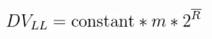
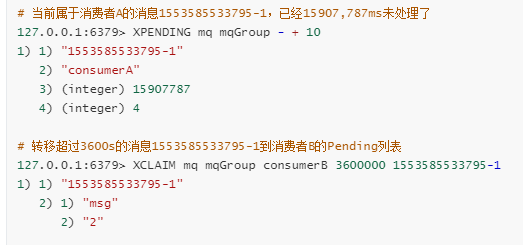

# redis

默认端口6379

缓存类型：本地缓存、分布式缓存、多级缓存

https://p1-jj.byteimg.com/tos-cn-i-t2oaga2asx/gold-user-assets/2019/11/21/16e8b5015c73003f~tplv-t2oaga2asx-watermark.image

## ⭐数据结构

实现：https://blog.csdn.net/weixin_41519463/article/details/109208476?utm_term=redis%E4%BA%94%E7%A7%8D%E6%95%B0%E6%8D%AE%E7%BB%93%E6%9E%84%E5%BA%95%E5%B1%82%E5%AE%9E%E7%8E%B0&utm_medium=distribute.pc_aggpage_search_result.none-task-blog-2~all~sobaiduweb~default-0-109208476&spm=3001.4430

1. string，内部是**SDS**（Simple Dynamic String ）
    1. 计数器
    2. 共享session
    
2. hash，类似map的结构一般放结构化数据，每次读写缓存的时候，可以就操作 **Hash** 里的**某个字段**。
   
    小数据是ziplist，大数据是hashtable
    
    结构以及优化：https://zhuanlan.zhihu.com/p/357165227
    java结构：链表+数组+红黑树 https://blog.csdn.net/yeyinfan123/article/details/106969585/?utm_medium=distribute.pc_relevant.none-task-blog-2~default~baidujs_baidulandingword~default-0.no_search_link&spm=1001.2101.3001.4242
    
    当key值数量倍增，发生hash冲突的概率也会增加，redis底层只有链表来存储，没有使用查询树等高效的数据结构，会让查询速度从O(1)退化到O(n)
    
3. list，有序列表                                                                                                                                                                                                                                                                                                                                                                                                  
    1. 消息队列，Lpush与BRpop
    2. 文章列表，数据分页，lrang进行区间查询

4. set，无序集合，自动去重

5. Sorted Set，去重而且排序
    1. 排行榜
    2. 做带权重的队列，工作优先度
3. 跳表原理：https://www.freesion.com/article/53941381568/
    
    4. rank补充实现：https://www.cnblogs.com/ljt12138/p/6684360.html
    
6. Bitmap，实现布隆过滤器

7. HyperLogLog，提供不精确的去重并且计数
    1. 统计uv
    2. 内部维护了 2^14 = 16384 个桶来记录各自桶的元素数量，当一个元素过来，它会散列到其中一个桶
    3. 在存入时，value 会被 hash 成 64 位，即 64 bit 的比特字符串，高 14 位用来选择这个 value 的比特串中`从右往左`第一个 1 出现的下标位置数值要存到那个桶中去，即前 14 位用来分桶。
    4. 不同的 value，会被设置到不同桶中去，如果出现了在同一个桶的，即前 14 位值是一样的。设第一个1出现位置的数值为 index ，但是后面出现 1 的位置不一样，那么比较原来的 index 是否比新 index 小。是，则替换。否，则不变。
    5. 
    6. 原理：https://www.cnblogs.com/linguanh/p/10460421.html

8. Geospatial，保存地理位置，后续可以做位置距离计算、计算最优地图路径

9. pub/sub：发布订阅

10. Pipeline：批量执行一组指令，减少频繁的连接和请求应答。

----

## 为什么redis快

1. 完全基于内存
2. 数据结构简单
3. 单线程，避免上下文切换和锁竞争，不会出现死锁
4. 多路IO，非阻塞IO
5. **底层模型不同**，redis和db的实现方式以及与和客户端通信协议不同，redis自己建立了vm机制，避免了调用系统函数（调用系统函数会浪费一定时间而去一定和请求）

使用了IO多路复用模型来监听多个套接字，文件事件处理器既实现了高性能的网络通信模型，又可以很好地与Redis服务器中其他同样以单线程运行的模块进行对接，这就保持了redis内部单线程设计的简单性。

**而且单线程能保证数据按顺序提交**

文件时间处理器链接：https://blog.csdn.net/weixin_42170152/article/details/106542493

----

## ⭐写问题和可持久化

redis有事务，但是他的事务只是单纯的串行执行命令，并且能保证全部执行，**但是执行命令失败的时候不会回滚，而是会继续执行**

### 两种持久化

实现原理补充：https://zhuanlan.zhihu.com/p/287875428

Redis不是WAL的：https://www.cnblogs.com/innocenter/p/13208034.html

完整分析RDB和AOF：https://www.cnblogs.com/mrmirror/p/13576342.html

**需要注意，redis的持久化只是为了重启后的数据恢复，对于不在内存的数据，那就是找不到了，不会取redis持久化的磁盘**

**但是阿里云混合存储实例突破 Redis 数据必须全部存储到内存的限制，使用磁盘存储全量数据，并将热数据缓存到内存，实现访问性能与存储成本的平衡。**

主要是RDB和AOF

RDB就是周期性地把内存的数据以快照形式写入磁盘，实际上是fork了一个子进程执行，二进制压缩存储。比较适合做不定时灾备。

AOF是以日志文件的形式记录Redis处理的每一个写入和删除。
对日志的写入操作支持每秒同步、每次修改同步和不同步。在糟糕的环境，我们会开启每次修改同步。

**AOF**的日志是通过一个叫**非常可读**的方式记录的，这样的特性就适合做**灾难性数据误删除**的紧急恢复了

比如公司的实习生通过**flushall**清空了所有的数据，**只要这个时候后台重写还没发生**，马上拷贝一份**AOF**日志文件，把最后一条**flushall**命令删了就完事了。

**RDB**更适合做**冷备**，**AOF**更适合做**热备**

**AOF>RDB**

**AOF是以只追加的方式写入的，这样就没有磁盘寻址开销，很快，类似mysql的binlog**

但是RDB在快照完成之前如果宕机，那么那段时间的数据就完全丢失了

而且保存快照可能会导致短时间服务不可用？因为如果文件很大，fork一个子进程去生成大快照的时候，客户端可能会暂停几秒。

**AOF<RDB**

对于同一份数据来说，AOF日志文件通常比RDB数据快照文件更大

恢复的时候RDB要快于AOF

而且RDB是额外进程工作，对redis影响小。

AOF刷新频率更高，所以QPS会低一些，虽然他是以fsync的形式，性能还是很高。

### 多个系统并发写

多个系统并发写，可能会造成顺序不一致的问题。

额外使用一个zookeeper做分布式锁（额外一个redis的setnx也可以）

核心思想：**确保同一时间只有一个实例在操作某个key**

### ⭐双写一致性、先进性

总体操作：先更新数据库，再删缓存

一般来说，使用了缓存，那就是允许稍微的弱一致性。

如果要保证缓存和数据库强一致性，那就要做**读写请求串行化**，把请求都串到一个内存队列去。

缺点是这队列容易阻塞，并发度下降。

此外，还会使用版本控制，保证缓存的先进（这个在统一配置中心用到了）

每次写入db，保存一个时间戳或者版本号，查出来的时候也要读取。

写入缓存之前判断时间戳是否比缓存的时间戳要更先进，如果是才能写。

参考：https://zhuanlan.zhihu.com/p/59167071

### KV、DB读写模式

1. 读的时候先读缓存，没有在读数据库，读完数据库之后放入缓存
2. 更新的时候更新数据库，**并删除缓存**

**Q：为什么是删除缓存而不是更新？**

更新缓存代价比较高把，如果我一个缓存设计了后面db多个表，这种操作的情况下，缓存可能会被频繁更新。

这其实是Lazy的思想。

----

## redis的rehash

redis的rehash采取的是渐进rehash的方式

因为redis是单线程，如果一次将键值对全部rehash，会影响服务器的性能。所以redis是分多次、渐进式地rehash。

分两种模式

1. 操作redis的时候，额外做一步rehash
2. 后台定时调用rehash

链接：https://blog.csdn.net/cqk0100/article/details/80400811

----

## redis的vm机制 *

链接：https://blog.csdn.net/Seky_fei/article/details/106843764

---

## mongoDB和redis

内存管理机制：redis数据全部存在于内存，**定期回写磁盘，如果内存不够就根据LRU算法删除数据。**mongoDB数据存在内存，由Linux的**mmap实现**，当内存不够，**只把热点数据放入内存**，其他数据放在磁盘。

数据结构：redis支持的数据结构丰富，包括hash、set、list等等。而mongoDB支持的数据结构单一，**但是数据表达丰富，可以有索引、类似关系型数据库的结构，支持的查询语言也很丰富**

---

## memcache和redis

mc

1. 多线程异步io处理请求，可以多核
2. 内存型
3. 失效策略
    1. 延迟失效，当再次使用数据的时候才决定是否失效
    2. 主动失效，当容量存满的时候会剔除过期key，或者按LRU剔除
4. 缺点
    1. key不能超过250字节、value不能超过1m
    2. key最大失效时间是30天
    3. 只支持k-v
    4. 不提供持久化和主从同步功能
    5. 数据格式单一，没有zset、list
    6. **不能保证数据不被剔除**

redis

1. 单线程，但是是非阻塞异步，可以避免线程上下文切换
2. 可以可持久化，数据格式丰富
3. 提供主从同步机制，以及Cluster集群部署能力，可以高可用

### 什么时候用redis

1. 需要redis的**Cluster** 模式做高可用，而 **Memcached** 没有原生的集群模式，需要依靠客户端来实现往集群中分片写入数据。
2. 数据表达更丰富
3. 

### 什么时候用mc

纯KV，数据量非常大，并发量非常大的业务

1. memcache使用预分配内存池的方式管理内存，能够省去内存分配时间。 redis则是临时申请空间，可能导致碎片。
2. memcache把所有的数据存储在物理内存里。redis有自己的VM机制，理论上能够存储比物理内存更多的数据，**当数据超量时，会引发swap，把冷数据刷到磁盘上。**
3. 由于redis还提供一些非KV存储之外的排序，聚合功能，在执行这些功能时，复杂的CPU计算，会阻塞整个IO调度。
4. memcache使用多线程，主线程监听，worker子线程接受请求，执行读写，这个过程中，可能存在锁冲突。redis使用单线程，虽无锁冲突，但难以利用多核的特性提升整体吞吐量。

### mc钙化问题

Memcached采用LRU，在内存容量满时踢出过期失效和LRU数据，为新数据腾出内存空间。

不过该淘汰算法在内存空间不足以分配新的Slab情况下，这时只会在同一类Slab内部踢出数据。

即当某个Slab容量满，且不能在内存足够分配新的Slab，只会在相同Slab内部踢出数据，而不会挪用或者踢出其他Slab的数据。

这种局部剔除就称为钙化。

**这样会造成，新写入的数据到了一个满的slab，那么很快又被剔除了**

解决：重启，随机过期其他slab的数据 

----

## ⭐key失效相关

key可以手动设置过期，过期之后redis采用主动和被动相结合的失效机制，一个是和mc一样访问时触发被动删除，一个是定期的主动删除。

定期+惰性+内存淘汰。

**为什么不全部扫一遍过期的key**

不可能，100ms一次都不可能

**如果一直没随机到很多key删除，那是不是会存在大量的无效key**

惰性删除解决

**定期策略没删，也没被查询，怎么办**

内存淘汰解决

1. LRU
    1. **allkeys-lru**：尝试回收最少使用的键，使得新添加的数据有空间存放。
    2. **volatile-lru**：尝试回收最少使用的键，但仅限于在过期集合的键,使得新添加的数据有空间存放。
2. **noeviction**：返回错误当内存限制达到并且客户端尝试执行会让更多内存被使用的命令（大部分的写入指令，但DEL和几个例外）
3. **volatile-random**：回收随机的键使得新添加的数据有空间存放，但仅限于在过期集合的键。
4. **volatile-ttl**：回收在过期集合的键，并且优先回收存活时间（TTL）较短的键,使得新添加的数据有空间存放。

**如果大量key同一时间过期怎么办**

key过期时间太集中，redis在那个时间点可能会卡顿，严重的话会内存雪崩。

解决：在时间上再加上小范围的随机值

---

## redis内存满了/保证热点

1. 增加内存
2. 换redis集群，细节设计：
    1. 所有的redis节点彼此互联(PING-PONG机制),内部使用二进制协议优化传输速度和带宽.
    2. 节点的fail是通过集群中**超过半数的节点检测**失效时才生效.
    3. 客户端与redis节点直连,不需要中间proxy层.客户端不需要连接集群所有节点,连接集群中任何一个可用节点即可
    4. 节点间相互通信，一半以上节点ping不同一个节点，则说明此节点挂掉，从节点顶上
3. 内存淘汰改为volatile-lru或者allkeys-lru。 

以上操作再加上冷热分离做优化

----

## redis做异步队列、延迟队列（原始）

一般使用list结构作为队列，**rpush**生产消息，**blpop**消费消息。

blpop会自动阻塞的

**如果要做1:N的消息队列呢？**

这时候就要用pub/sub，但是这有缺点，那就是sub下线的话就永久丢失了，这就要用专业的MQ了，比如rocketMQ、rabbitMQ

**延迟队列？**

使用sorted-set，拿时间戳作为score，消息内容作为key调用zadd来生产消息

消费者用**zrangebyscore**指令获取N秒之前的数据轮询进行处理。

### 具体实现消息队列

参考：https://segmentfault.com/a/1190000012244418

主要关注以下几个点：

1. 如何实时消费
2. 如何实现ACK机制
3. 如何保证高性能的流量削峰

第一种实现方法就是两个redis队列，将消息从第一个队列转存到第二个队列，在转存的过程中，由消费者先拿到消息，然后无条件转存到“处理中”队列。

消费者需要完成消息处理，再移除“处理中”的消息。如果消费者在处理消息的时候挂掉，那么消息会在第二个队列。

所以还需要一个定期任务去处理“处理中”队列的消息。

**两个问题**

1. 如果多个消费者把消息转入第二个队列，其中一个消费者处理完自己的消息之后很难在第二个队列中找到并删除。
    除非某个消费者的消息很特别，可以通过**lrem**函数直接找到并删除。
2. 第二个队列承载量太大，而且redis是单线程的不能使用并发。

**实现即时消费**

以前的做法是使用redis的发布订阅功能。

现在可以使用redis的stream

参考：https://blog.csdn.net/valada/article/details/88904110

**实现ACK机制**

模仿RabbitMQ的ack

1. Publisher把消息通知给Consumer，如果Consumer已处理完任务，那么它将向Broker发送ACK消息，告知某条消息已被成功处理，可以从队列中移除。
2. 如果通知之后没有ACK，转发信息到其他channel，让其他消费者来处理。

维护两个结构：pending和doing

1. workers定义为线程池
2. pending发出消息之后，workers开一个线程去处理消息，并且给消息附加时间戳和一个ID索引，把消息转存到doing。
3. worker完成任务之后，根据ID索引去删除。
4. 额外一个定时任务定期扫描doing
5. 如果worker未能完成任务，就主动回滚把任务push到pending。

### 有赞延迟队列

链接：https://tech.youzan.com/queuing_delay/

### 缺陷分析

链接：https://blog.csdn.net/weixin_39735166/article/details/110515871

----

## redis消息队列（侧重分发）

**基于redis stream的消费组模式的设计**

### stream介绍

Stream为redis 5.0后新增的数据结构。支持多播的可持久化消息队列，实现借鉴了Kafka设计。

Redis Stream的结构如上图所示，**它有一个消息链表，将所有加入的消息都串起来，每个消息都有一个唯一的ID和对应的内容**。**消息是持久化的**，Redis重启后，内容还在。

每个Stream都有唯一的名称，它就是Redis的key，在我们**首次使用xadd指令追加消息时自动创建**。

**每个Stream都可以挂多个消费组，每个消费组会有个游标last_delivered_id在Stream数组之上往前移动，表示当前消费组已经消费到哪条消息了**。每个消费组都有一个Stream内唯一的名称，消费组不会自动创建，它需要单独的指令xgroup create进行创建，需要指定从Stream的某个消息ID开始消费，这个ID用来初始化last_delivered_id变量。

**同一个消费组(Consumer Group)可以挂接多个消费者(Consumer)，这些消费者之间是竞争关系**，任意一个消费者读取了消息都会使游标last_delivered_id往前移动。每个消费者者有一个组内唯一名称。

**每个消费者(Consumer)内部会有个状态变量pending_ids**，它记录了当前已经被客户端读取的消息，但是还没有ack

如果客户端没有ack，这个变量里面的消息ID会越来越多，一旦某个消息被ack，它就开始减少。

这个pending_ids变量在Redis官方被称之为PEL，也就是Pending Entries List，这是一个很核心的数据结构，它用来确保客户端至少消费了消息一次，而不会在网络传输的中途丢失了没处理。

**指令：**

1. 使用`XADD`命令可以向队列中添加消息，当被添加的key不存在时创建新的队列。

   1. 子命令`MAXLEN`，正如上面提到的它可以设置队列的消息上限，你还可以通过`~`来设置一个不精确的上限，例如`MAXLEN~ 1000`。

   2. XADD命令的返回值是消息ID，不管你是自定义的ID或者通过*使用默认的ID，ID都必须满足单向递增且唯一的特点。

      默认ID是毫秒级的时间戳+当前时间的消息序号组成的，两个数字都是64的，基本上是没有机会重复，还有大型分布式项目都是靠Redis来生唯一ID的，所以最好还是使用默认的ID生成规则。

2. 使用`XGROUP`来对队列设置分组，把客户端与分组进行关联。

3. 使用`XREADGROUP`来获取分组后的消息，读消息时会告知分组名称和当前客户端名称，为后面的消息监控和消息流转做支持。

4. `XREADGROUP`与`XREAD`的操作基本上是一致的，都有`COUNT`子命令来获取返回消息数量；`BLOCK`选择阻塞时长，单位毫秒，时长为0时永远阻塞，默认是不要`BLOCK`，是非阻塞模式；`STREAMS`限定接收的消息ID。

5. 使用`XACK`确认消息处理，使用`XREADGROUP`读取的消息，服务器将会记住消息传递的客户端名称，消息会被存储在消费者组内的待处理条目列表（PEL）中，即已送达但尚未确认的消息ID列表。

6. 可以使用`XPENDING`来查看未确认的消息ID列表，可以查看知道的客户端的PEL，返回值包括消息ID、客户端名称（消息的所有者）、**消息传递给客户端到现在的毫秒数**、该消息被传递的次数。

7. 在消息被确认处理前消息的所有者是有可能宕机的，短时间内无法恢复的时候，我们不能让这个消息一直在所有者的PEL，需要使用`XCLAIM`命令把消息传递给新的客户端，让消息继续被处理。

### 具体设计

#### 为什么选redis 作为消息队列组件

- 对实时性要求高，支持快速读写
- 当前kafka 资源紧张
- 已经有可靠的redis 服务
- kafka高效原因：https://www.cnblogs.com/duanxz/p/4705164.html
- kafka实战错误排查：https://www.cnblogs.com/yougewe/p/8975550.html
- kafka消费组数量较大的影响：https://www.zhihu.com/question/57278539/answer/2165831297

#### 队列设计

- **stream**: 生产者`dispatcher`通过REST API接收数据，并且将数据写入redis `stream`。
  - XADD命令
- **consumer group**: 系统首次启动时，`dispatcher`服务会先初始化`stream` 对应的`consumer group`。
  - 使用`XGROUP`来对队列设置分组，把客户端与分组进行关联。
- **consumer**: 每个`dds`服务都会在`consumer group`里生成一个独立的`consumer`，并且通过`consumer`来消费`stream`里的消息。每个`consumer`每次都从`stream`里读取未被推送(deliver)的消息，例如当stream里有消息[1, 2, 3, 4]，consumer A 获取了消息1、2、3，但是都还没有ACK，这时consumer B会获取消息4。
- **`PEL`**: Pending Entries List 里存放着被`consumer`获取但是还没有ACK 的消息。当消费者从`stream` 读取消息时，消息会同时被写入`PEL`。消费者处理完该消息后，会主动向`redis`发送ACK消息，将消息从`PEL`里移除。
  - 使用`XACK`确认消息处理，使用`XREADGROUP`读取的消息，服务器将会记住消息传递的客户端名称，消息会被存储在消费者组内的待处理条目列表（PEL）中，即已送达但尚未确认的消息ID列表。

#### 消息恢复

- **悬空PEL**：每个`dds`服务会通过在redis 维护心跳来显示自己的健康状态。假如服务宕机，对应的**非空**`PEL`就会变成悬空`PEL` (dangling PEL)。

  - 对于每个服务，用一个额外的redis set去保存心跳、pending_ids等信息，设置为1min过期，50s更新数据。如果过期，说明心跳停止。

- **恢复线程**：每个`dds`服务都会有一条恢复线程，定期地查看`consumer group`有没有`dangling PEL`。当发现`dangling PEL`时，`dds`会发出 xclaim 指令，将`dangling PEL` append 到自己的`PEL`后面，并且进入恢复流程。
- 实际上就是使用XPENDING指令检查最大的10条未处理信息
  
- 
    
  - 这就完成了一次消息转移，转移除了要指定ID外，还需要指定IDLE，保证是长时间未处理的才被转移。
  
  - 被转移的消息的IDLE会被重置，用以保证不会被重复转移，以为可能会出现将过期的消息同时转移给多个消费者的并发操作，设置了IDLE，则可以避免后面的转移不会成功，因为IDLE不满足条件。
  
- **恢复流程**：当`dds`进入恢复流程时，会直接从`PEL`(而不是`stream`)获取消息。当`PEL`的消息被获取并且ACK完后，`dds`会进入正常的消费流程。

### 其他问题

**消息如果忘记ACK会怎样？**

Stream在每个消费者结构中保存了正在处理中的消息ID列表PEL，如果消费者收到了消息处理完了但是没有回复ack，就会导致PEL列表不断增长，如果有很多消费组的话，那么这个PEL占用的内存就会放大。

**PEL如何避免消息丢失？**

在客户端消费者读取Stream消息时，Redis服务器将消息回复给客户端的过程中，客户端突然断开了连接，消息就丢失了。

但是PEL里已经保存了发出去的消息ID。待客户端重新连上之后，可以再次收到PEL中的消息ID列表。

不过此时xreadgroup的起始消息必须是任意有效的消息ID，一般将参数设为0-0，表示读取所有的PEL消息以及自last_delivered_id之后的新消息。

**缺点**

它弥补了Redis Pub/Sub不能持久化消息的缺陷。但是它又不同于kafka，kafka的消息可以分partition，而Stream不行。

如果非要分parition的话，得在客户端做，提供不同的Stream名称，对消息进行hash取模来选择往哪个Stream里塞。

-----

## ⭐redis简陋分布式锁

- 指定一个 key 作为锁标记，存入 Redis 中，指定一个 唯一的用户标识作为 value。
- 当 key 不存在时才能设置值，确保同一时间只有一个客户端进程获得锁，满足互斥性特性。
- 设置一个过期时间，防止因系统异常导致没能删除这个 key，满足防死锁特性。
- 当处理完业务之后需要清除这个 key 来释放锁，清除 key 时需要校验 value 值，需要满足只有加锁的人才能释放锁 。

**存在bug**

如果这个锁的过期时间是30秒，但是业务运行超过了30秒，比如40秒，当业务运行到30秒的时候，锁过期了，其他客户端拿到了这个锁，怎么办

问题的关键在于LockTime的设计

- LockTime设置过小，锁自动超时的概率就会增加，锁异常失效的概率也就会增加；
- LockTime设置过大，万一服务出现异常无法正常释放锁，那么出现这种异常锁的时间也就越长。

### 看门狗自动续期

给锁设置一个LockTime，然后启动一个守护线程，让守护线程在一段时间后，重新去设置这个锁的LockTime。

- 和释放锁的情况一样，需要先判断持有锁客户端是否有变化。否则会造成无论谁持有锁，守护线程都会去重新设置锁的LockTime。
- 守护线程要在合理的时间再去重新设置锁的LockTime，否则会造成资源的浪费。不能无条件地续。
- 如果持有锁的线程已经处理完业务了，那么守护线程也应该被销毁。不能业务运行结束了，守护者还在那里继续运行，浪费资源。

**实际解决方案**

使用 Redisson，利用它的看门狗机制。

- 尝试获取锁，返回 null 则说明加锁成功，返回一个数值，则说明已经存在该锁，ttl 为锁的剩余存活时间。
- 如果此时客户端 2 进程获取锁失败，那么使用客户端 2 的线程 id（其实本质上就是进程 id）通过 Redis 的 channel  订阅锁释放的事件。
- 如果等待的过程中一直未等到锁的释放事件通知，当超过最大等待时间则获取锁失败，返回 false。如果等到了锁的释放事件的通知，则开始进入一个不断重试获取锁的循环。
- 循环中每次都先试着获取锁，并得到已存在的锁的剩余存活时间。
- 如果在重试中拿到了锁，则直接返回。
- 如果锁当前还是被占用的，那么等待释放锁的消息，具体实现使用了信号量 Semaphore 来阻塞线程，当锁释放并发布释放锁的消息后，信号量的 release()  方法会被调用，此时被信号量阻塞的等待队列中的一个线程就可以继续尝试获取锁了。
- 当锁正在被占用时，等待获取锁的进程并不是通过一个 while(true) 死循环去获取锁，而是利用了 Redis 的发布订阅机制,通过 await 方法阻塞等待锁的进程，有效的解决了无效的锁申请浪费资源的问题。

**看门狗自动续期**

Redisson看门狗机制， 只要客户端加锁成功，就会启动一个 Watch Dog。

- leaseTime 必须是 -1 才会开启 Watch Dog 机制（未指定加锁时间），**如果需要开启 Watch Dog 机制就必须使用默认的加锁时间为 30s。**
- 如果自定义时间，超过这个时间，锁就会自定释放，并不会自动续期。

续期原理其实就是用lua脚本，将锁的时间重置为30s

- Watch Dog 机制其实就是一个后台定时任务线程，获取锁成功之后，会将持有锁的线程放入到一个  RedissonLock.EXPIRATION_RENEWAL_MAP里面
- 然后每隔 10 秒 （internalLockLeaseTime / 3） 检查
- 如果客户端还持有锁 key（判断客户端是否还持有 key，其实就是遍历 EXPIRATION_RENEWAL_MAP  里面线程 id 然后根据线程 id 去 Redis 中查，如果存在就会延长 key 的时间），那么就会不断的延长锁 key 的生存时间。**这些都是通过lua脚本去做的。**
- 续期成功自己调用自己，也就是为下一次续期做准备

- 如果服务宕机了，Watch Dog 机制线程也就没有了，此时就不会延长 key 的过期时间，到了 30s 之后就会自动过期了，其他线程就可以获取到锁。

如果释放锁操作本身异常了，watch dog 还会不停的续期吗？

不会，因为无论释放锁操作是否成功，EXPIRATION_RENEWAL_MAP中的目标 ExpirationEntry 对象已经被移除了，watch dog 通过判断后就不会继续给锁续期了。

知乎完整补充：https://zhuanlan.zhihu.com/p/135864820

---

## redis实现限流

参考：https://www.cnblogs.com/xiaozengzeng/p/12642394.html

1. 固定窗口大小：使用一个计数器，在规定时间内限制请求次数
    1. 缺点：如果前一个段最后一秒收到了100请求，后一个段第一秒收到了100请求，那就是两秒之内收到了200请求，这不是我们想看到的。
2. 滑动窗口大小：随着时间的推移，时间窗口也会持续移动，有一个计数器不断维护着窗口内的请求数量，这样就可以保证任意时间段内，都不会超过最大允许的请求数。
    例如当前时间窗口是0s\~60s，请求数是40，10s后时间窗口就变成了10s\~70s，请求数是60。
    1. 时间窗口的滑动和计数器可以使用redis的有序集合(sorted set)来实现。
    2. score的值用毫秒时间戳来表示，可以利用 `当前时间戳` - `时间窗口的大小` 来计算出窗口的边界，然后根据score的值做一个范围筛选（删掉之前的）就可以圈出一个窗口；
    3. value的值仅作为用户行为的唯一标识，也用毫秒时间戳就好。最后统计一下窗口内的请求数再做判断即可。
    4. 缺点：虽然滑动窗口法避免了时间界限的问题，但是依然无法很好解决细时间粒度上面请求过于集中的问题，就例如限制了1分钟请求不能超过60次，请求都集中在59s时发送过来，这样滑动窗口的效果就大打折扣。 为了使流量更加平滑，可以使用令牌桶算法和漏桶算法。
    5. go参考：https://zhuanlan.zhihu.com/p/95794476
3. 令牌桶：令牌桶算法的思路不复杂，先以固定的速率生成令牌，把令牌放到固定容量的桶里，超过桶容量的令牌则丢弃，每来一个请求则获取一次令牌，规定只有获得令牌的请求才能放行，没有获得令牌的请求则丢弃。
    1. **令牌桶法限制的是请求的平均流入速率**，优点是能应对一定程度上的突发请求，也能在一定程度上保持流量的来源特征，实现难度不高，适用于大多数应用场景。
    2. 令牌桶可以用来保护自己，主要用来 对调用者频率进行限流，为的是让自己不被打垮。
4. 漏桶：漏桶算法的思路与令牌桶算法有点相反。
    1. 将请求想象成是水流，水流可以任意速率流入漏桶中，同时漏桶以固定的速率将水流出。如果流入速度太大会导致水满溢出，溢出的请求被丢弃。
    2. 漏桶法的特点是：**不限制请求流入的速率，但是限制了请求流出的速率。**这样突发流量可以被整形成一个稳定的流量，不会发生超频。
    3. 主要场景是，当调用的第三方系统本身没有保护机制，或者有流量限制的时候，我们的调用速度不能超过他的限制，由于我们不能更改第三方系统，所以只有在主调方控制。
5. 基于meter的漏桶：一个计数器，有消息要发送的时候，就看计数器够不够。如果计数器没有满的话，那么这个消息就可以被处理，如果计数器不足以发送消息的话，那么这个消息将会被丢弃。
    1. 计数器：基于 meter 的形式的计数器就是发送的频率，例如设置频率是不超过 5条/s ，那么计数器就是 5，在一秒内你每发送一条消息就减少一个，当你发第 6 条的时候计时器就不够了，那么这条消息就被丢弃了。
6. 基于queue的漏桶：一个计数器，这个计数器却不表示速率限制，而是表示 queue 的大小，这里就是当有消息要发送的时候看 queue  中是否还有位置，如果有，那么就将消息放进 queue 中，这个 queue 以 FIFO 的形式提供服务；如果 queue  没有位置了，消息将被抛弃。
    1. **消息被放进 queue 之后，还需要维护一个定时器，这个定时器的周期就是设置的频率周期**，例如设置频率是 5条/s，那么定时器的周期就是 200ms，定时器每 200ms 去 queue 里获取一次消息，如果有消息，那么就发送出去，如果没有就轮空。

### redis-cell限流模块

Redis 4.0 提供了一个限流 Redis 模块，它叫 redis-cell。该模块也使用了漏斗算法，并提供了原子的限流指令。有了这个模块，限流问题就非常简单了。

 这个模块需要单独安装，安装教程网上很多，它只有一个指令：`CL.THROTTLE`

----

## pipeline

可以将多次IO往返的时间缩减为一次，前提是**pipeline**执行的指令之间没有因果相关性

实际中使用**redis-benchmark**进行压测的时候可以发现影响redis的QPS峰值的一个重要因素是**pipeline**批次指令的数目。

---

## 三种get对比

**hset** 和 **hget** 都能在 **4ms** 之内完成，且每秒并发处理量都在 **7.5万个请求**之上；

**hmset** 和 **hmget** 一次操作两个数据，都能在 **5ms** 之内完成，且每秒并发处理量都在 **7.1万个请求**之上。

当我们使用HGETALL的时候，必须遍历每个字段来[获取](https://www.jb51.cc/tag/huoqu/)数据，这期间消耗的[cpu](https://www.jb51.cc/tag/cpu/)资源和字段数成正比，如果还用了PIPELINING，那就会更慢。

### 解决hgetall慢速问题

不改变redis，额外使用memcached，里面存储原本需要在redis里hgetall的hash。

这样可以直接查到整条obj（目的也是这个），不需要遍历所有字段，只是需要对obj做序列化和反序列化。

**还可以做序列化字段冗杂**

把所有字段额外存储到一个[all]的字段，其内容是原hash数据的序列化。之后使用hget就行了。

----

##  ⭐redis雪崩、穿透、击穿

一般缓存都是定时任务去刷新，或者是查不到之后去更新的，定时任务刷新就有一个问题。

**雪崩**

当我某个时间有大量的key过去，这时候所有请求都会落到DB，更有可能DBA这时候直接挂了，或者直接重启数据库，重启之后又立刻被打死了。这就是雪崩

解决：

1. 批量往**Redis**存数据的时候，把每个Key的失效时间都加个随机值，可以保证数据不会在同一时间大面积失效
2. 如果**Redis**是集群部署，将热点数据均匀分布在不同的**Redis**库中也能避免全部失效的问题
3. 或者设置热点数据永远不过期，有更新操作就更新缓存

**穿透**

穿透是指请求缓存和db中都没有的数据，但是用户不断请求，那么db可能就撑不住了。

可能产生的原因：参数非法！

解决：

1. 参数校验
2. 用户鉴权，同时做额外的认证token过期
3. 缓存和db都没有的数据，直接把缓存key对应的value改为null或者其他信息，并且设置暂时的短期过期，这样可以缓解。
4. 布隆过滤器
5. 

**击穿**

雪崩是因为大面积缓存失效，击穿是某个key特别热点，在不停地扛住大并发，而当这个key失效的瞬间，持续的大并发就会击破缓存，政治家打到db。

解决：

1. 热点数据不过期
2. 互斥锁，对db加锁（zookeeper，额外redis），这样可以保证击穿的第一时间不会有大请求，而后续也会转入redis了

总的来说，还可以走限流，如果我限制一半的流量，保证db不死，对于用户来说只是多刷新几次的感受。

---

## 连招

### 单线程会浪费多核吗

单线程没错，但是单机可以开多个redis实例。

### 如何解决单机性能瓶颈

部署redis集群——redis cluster，**并且使用主从同步读写分离**，开多个master节点，每个节点挂在多个salve节点。

后面要扩容就直接加master节点。

### redis分布锁怎么回事

先用setnx指令（set if not exists 只有不存在的时候才设置, 设置成功时返回 1 ， 设置失败时返回 0 ）来争抢锁，抢到之后用expire给锁加过期时间让他自动释放。

但是实际上可以使用现成的[ Redis分布式锁(RedLock) - 多节点](https://blog.csdn.net/varyall/article/details/88422492?utm_medium=distribute.pc_relevant.none-task-blog-2~default~baidujs_title~default-4.no_search_link&spm=1001.2101.3001.4242)

### 如果setnx之后expire之前进程意外crash怎么办

想办法把setnx指令和expire卡在一起

主要是利用set指令，set可以同时设置失效时常。

### redis cluster 节点之间通信

redis cluster节点间采取gossip协议进行通信

跟集中式不同，不是将集群元数据（节点信息，故障，等等）集中存储在某个节点上，而是互相之间不断通信，保持整个集群所有节点的数据是完整的

gossip：好处在于，元数据的更新比较分散，不是集中在一个地方，更新请求会陆陆续续，打到所有节点上去更新，有一定的延时，降低了压力; 缺点，元数据更新有延时，可能导致集群的一些操作会有一些滞后

每个节点都有一个专门用于节点间通信的端口，就是自己提供服务的端口号+10000，比如7001，那么用于节点间通信的就是17001端口，每隔节点每隔一段时间都会往另外几个节点发送ping消息，同时其他几点接收到ping之后返回pong

交换的信息：故障信息，节点的增加和移除，hash slot信息，等等

链接：https://blog.csdn.net/chen1092248901/article/details/85330786

### redis cluster 节点之间数据交互

Redis 集群使用数据分片（sharding）而非一致性哈希（consistency hashing）来实现

一个 Redis 集群包含 16384 个哈希槽（hash slot）， 数据库中的每个键都属于这 16384 个哈希槽的其中一个。对每个 key 计算 CRC16 值，然后对 16384 取模，可以获取 key 对应的 hash slot。

集群数据以数据**分布表**的方式保存在各个slot上。集群只有在16384个slot都有对应的节点才能正常工作。

slot可以动态的分配、删除和迁移。

每一个节点负责维护一部分槽以及槽所映射的键值数据

每个节点会保存一份数据分布表，节点会将自己的slot信息发送给其他节点，发送的方式使用一个unsigned char(8 btyes)的

每个bit标识为0或者1来标识某个slot是否是它负责的。

为了节省带宽，redis选择了只传递自己的分布数据。

但这样的方式也会带来管理方面的麻烦，如果一个节点删除了自己负责的某个slot，这样该节点传递给其他节点数据分布表的slot标识为0

**redis采用了bitmapTestBit方法，只处理slot为1的节点，而并未把每个slot与收到的数据分布表对比，**
从而产生了节点间数据分布表视图的不一致。这种问题目前只能通过使用者来避免。

**数据访问**

1. 客户端在初始化的时候只需要知道一个节点的地址即可，客户端会先尝试向这个节点执行命令
2. 如果key所在的slot刚好在该节点上，则能够直接执行成功。
3. 如果slot不在该节点，则节点会返回MOVED错误，同时把该slot对应的节点告诉客户端。
4. 目前客户端有两种做法获取数据分布表：
    1. 客户端每次根据返回的MOVED信息缓存一个slot对应的节点，但是这种做法在初期会经常造成访问两次集群。
    2. 在节点返回MOVED信息后，通过cluster nodes命令获取整个数据分布表，这样就能每次请求到正确的节点，一旦数据分布表发生变化，请求到错误的节点，返回MOVED信息后，重新执行cluster nodes命令更新数据分布表。

在访问集群的时候，节点可能会返回ASK错误。

这种错误是在key对应的slot正在进行数据迁移时产生的，这时候向slot的原节点访问，如果key在迁移源节点上，则该次命令能直接执行。

**如果key不在迁移源节点上，则会返回ASK错误，描述信息会附上迁移目的节点的地址。**客户端这时候要先向迁移目的节点发送ASKING命令，然后执行之前的命令。

### redis cluster 节点如何加入

每个节点都会跟其他节点保持连接，用来交换彼此的信息。

节点组成集群的方式使用cluster  meet命令

**meet命令可以让两个节点相互握手，然后通过gossip协议交换信息。**

如果一个节点r1在集群中，新节点r4加入的时候与r1节点握手，
r1节点会把集群内的其他节点信息通过gossip协议发送给r4，
r4会一一与这些节点完成握手，从而加入到集群中。

### 故障转移

1. 资格检查，被标记为客观下线的主节点的所有个从节点都要检查最后与主节点断线时间，判断是否有资格替换故障的主节点。（断线时间过长的不行）
2. 计算下线主节点所有从节点的优先级排名（复制偏移量越大优先级越高），排名高的从节点优选获得选举权，排名每降低一位则延迟1秒开始选举。
3. 当从节点定时任务检测到达故障选举时间到达后，发起选举流。在集群内广播选举消息（FAILOVER_AUTH_REQUEST），并记录已发送过消息的状态，保证该从节点在一个配置纪元内只能发起一次选举。
4. 有持有槽的主节点才会处理故障选举消息（FAILOVER_AUTH_REQUEST），因为每个持有槽的节点在一个配置纪元内都有唯一的一张选票，
    1. 当接到第一个请求投票的从节点消息时回复FAILOVER_AUTH_ACK消息作为投票
    2. 之后相同配置纪元内其他从节点的发送过来的选举消息将忽略。
    3. offset越大的从节点越先发送选举消息，可以降低主从复制数据的丢失的数据量
    4. 如集群内有N个持有槽的主节点代表有N张选票。
    5. 由于在每个配置纪元内持有槽的主节点只能投票给一个从节点，因此只能有一个从节点获得N/2+1超过半数的选票，保证能够找出唯一的从节点。
5. 投票成功的从节点取消复制变为主节点。
    1. 执行clusterDelSlot操作撤销故障主节点负责的槽，并执行clusterAddSlot把这些槽委派给自己。
    2. 向集群广播消息，通知集群内所有的节点当前从节点变为主节点并接管了故障主节点的槽信息。

### redis其他高可用方式

除了redis cluster，还有哨兵集群**sentinel**。同样的在数据分发服务那里使用了。

哨兵必须用三个哨兵实例去保证自己的健壮性的，哨兵+主从并**不能保证数据不丢失**，但是可以保证集群的**高可用**。

两个实例的话：
master宕机了 s1和s2两个哨兵只要有一个认为你宕机了就切换了，并且会选举出一个哨兵去执行故障，但是这个时候也需要大多数哨兵都是运行的。

比如master和s1在同一个机器上，m挂了是没问题的，但如果整个机器挂了那就只剩下s2了，那就变成了没有哨兵的情况，**这样就始终不执行故障转移了**

**所以起码要三个哨兵实例，而且在三个物理机上，这样可以保证始终选举出可以执行故障转移的节点**

------

### 主从之间的数据怎么同步

这跟前面的**RDB**和**AOF**有着密切的关系。

**首先是为什么使用主从**

因为单机QPS有上限，而redis的特点是必须支持读高并发的，所以我们不希望一台机器又读又写
我们希望master机器去写，数据同步给其他slave机器，他们都拿去读，分发掉大量的请求。

**如何初始同步**

启动一台slave的同时会发送一个psync命令给master，如果是第一次连接，那就触发一个全量复制。

master之后会启动一个线程，生成RDB快照，把新的写请求暂时缓存在内存，RDB生成之后把这个RDB发送给slave。

slave拿到全量RDB，写进磁盘，然后再加载进内存，最后master会把之前暂存的缓存发给slave。

**增量复制**

当`slave`节点与`master`全量同步后，`master`节点上数据再次发生更新，就会触发增量复制。

当我们在 `master` 服务器增减数据的时候，就会触发 `replicationFeedSalves()`函数，接下来在 `Master` 服务器上调用的每一个命令都会使用`replicationFeedSlaves()` 函数来同步到`Slave`服务器。

在执行此函数之前`master`服务器会判断用户执行的命令是否有数据更新，如果有数据更新并且`slave`服务器不为空，才会执行此函数，函数主要的工作就是把用户执行的命令发送到所有的 `slave`服务器，让`slave`服务器执行。

**断点续传**

断点续传或者说是断点恢复复制，也就是说 slave 因为某种原因与`master`断开连接了一段时间，然后又与`master`发生重连。

`redis2.8`以后对于这种场景进行了优化，开始加入了`PSYNC`同步策略。这种策略性能一定是大于全量复制的。

1. 从服务器向主服务器发送`PSYNC`命令，携带主服务器的`runid`和复制偏移量；
2. 主服务器验证`runid`和自身`runid`是否一致，如不一致，则进行全量复制；
3. 主服务器验证复制偏移量是否在积压缓冲区内，如不在，则进行全量复制；
4. 如都验证通过，则主服务器将保持在积压区内的偏移量后的所有数据发送给从服务器，主从服务器再次回到一致状态

### redis主从优缺点

优点：

1. 高可靠性：一方面，采用双机主备架构，能够在主库出现故障时自动进行主备切换，从库提升为主库提供服务，保证服务平稳运行；另一方面，开启数据持久化功能和配置合理的备份策略，能有效的解决数据误操作和数据异常丢失的问题；
2. 读写分离策略：从节点可以扩展主库节点的读能力，有效应对大并发量的读操作。

缺点：

1. 故障恢复复杂，如果没有`RedisHA`系统（需要开发），当主库节点出现故障时，需要手动将一个从节点晋升为主节点，同时需要通知业务方变更配置，并且需要让其它从库节点去复制新主库节点，整个过程需要人为干预，比较繁琐；
2. 主库的写能力受到单机的限制，可以考虑分片；
3. 主库的存储能力受到单机的限制，可以考虑`Pika`；
4. 原生复制的弊端在早期的版本中也会比较突出，如：`Redis`复制中断后，`Slave`会发起`psync`，此时如果同步不成功，则会进行全量同步，主库执行全量备份的同时可能会造成毫秒或秒级的卡顿；又由于`COW`机制，导致极端情况下的主库内存溢出，程序异常退出或宕机；主库节点生成备份文件导致服务器磁盘`IO`和`CPU`（压缩）资源消耗；发送数`GB`大小的备份文件导致服务器出口带宽暴增，阻塞请求，建议升级到最新版本。

### 高可用也不能避免断网或物理宕机

传输过程中有什么网络问题之类的，会自动重连的，并且连接之后会把缺少的数据补上的。

**需要记得的就是，RDB快照的数据生成的时候，缓存区也必须同时开始接受新请求，不然旧的数据过去了，在同步期间的增量数据就丢失了？**

### 高可用总结

https://www.jianshu.com/p/5de2ab291696

---

## ⭐实际使用、要注意的问题

1. Redis 是单线程处理请求，应尽量避免耗时较高的单个请求任务，防止相互影响；
2. Redis 服务应避免和其他 CPU 密集型的进程部署在同一机器；
3. 考虑下禁用 Swap 内存交换，防止 Redis 的缓存数据交换到硬盘上，影响性能。
4. 在sentry传入dispatch分发之前设置redis，目的是解决dispatch消费速度和sentry生产速度不一致的问题（消费太慢了）。
5. **tip：两种可持久化全部开启的时候，Redis在重启的时候会默认使用AOF去重新构建数据，因为AOF的数据是比RDB更完整的。**
6. 单独用**RDB**会丢失很多数据，单独用**AOF**，数据恢复没**RDB**来的快
    实际应用的时候第一时间用**RDB**恢复，然后**AOF**做数据补
7. 故障处理
    1. 事前：**Redis** 高可用，主从+哨兵，**Redis cluster**，避免全盘崩溃。
    2. 事中：本地 **ehcache** 缓存 + **Hystrix** 限流+降级，避免db被打死。
    3. 事后：**Redis** 持久化 **RDB**+**AOF**，一旦重启，自动从磁盘上加载数据，快速恢复缓存数据。
    4. 数据恢复实战：https://www.cnblogs.com/linguoguo/p/5430468.html

### redis性能优化

使用多jedis客户端的方式，对jedisCluster进行封装，进行手动分片之后负载均衡到不同的jedis上执行pipeline命令。

-----

补充：https://blog.csdn.net/yajlv/article/details/73467865