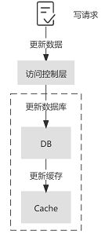

# 微服务架构设计总结

主要是对于架构的思考，具体的需要找现成方案。

https://gudaoxuri.gitbook.io/microservices-architecture/

## 服务划分

一个合理的服务划分

1. 符合团队结构，再进行对应的排期
2. 业务边界清晰，尽量一个服务对应一个业务，**服务之间单向依赖，不要出现环或双向。**
3. 冗杂避免，基于第二点，不要出现多个服务都能实现同一个功能的情况。
4. 最小化变更，服务如果变更，那么受到影响的业务应该尽可能的少。
5. 最大化复用
6. 性能稳定
7. 简洁，特别是在考虑引入中间件的时候，慎重评估必要性。

---

## 接口协议

主流的接口协议就两大类：RPC和RESTful

> 🔆 RPC(Remote Procedure Call): 以本地方法调用的形式处理远程方法调用的模型。常用的有：SOAP、RMI、Thrift、Avro、gRPC、Dubbo协议。
>
> 🔆 REST(REpresentational State Transfer)：以资源为中心，描述资源状态变更的模型。常见于HTTP协议。

### RPC优缺点

常见RPC：gRPC、Dubbo

使用RPC一般而言要先定义IDL（Interface description language，接口描述言）

**优点**

- 可定制协议、传输类型，实现高性能通讯
- 可用于强格式约束唱K

**缺点**

- 调用方一般有语言约束
- **字段变更的话，多方都要重新部署**，因为必须修改IDL

### RESTful优缺点

基于HTTP协议实现（一般）

代表：Spring cloud

**优点**

- 通用性强，没有语言约束（这也是目的）
- 弱格式约束
- 防火墙友好，HTTP作为最普遍的协议更容易被防火墙接受

REST一般会基于Json或XML做为交互格式，两者均为跨语言、弱约束的格式。我们不需要先定义IDL再生成对应的语言文件，接口的变更除受影响的参与方需要修改外不需要全局重新部署

**缺点**

- 传输效率相对地没有RPC高
- 没有强契约规范，字段的修改可能会导致已接入调用方的异常

### 选择

对比REST的代表Spring Cloud与RPC的代表Dubbo，IO性能上前者比后者慢1/2左右，但对于实际业务调用场景而言，大部分情况下通讯上的这些损失是可以接受的，**并且我们还可以用缓存、压缩等方式进一步减少两者的差距**。

对于部分业务相对稳定的服务，尤其是一些核心的高频调用的公共服务，我们可以考虑使用RPC以提升效率并强制锲约检查

对于需要频繁修改调用参数的，TPS要求不高的，可以先选择REST。

---

## 事件解耦

**事件驱动架构（Event-Driven Architecture）与SOA一样是一种软件架构风格。相较而言，SOA关注的是静态架构，而EDA关注的是动态的、数据流的架构。**

非核心逻辑放到新的线程中执行，用户注册在完成doRegister后即可返回，这可能也是我们比较常见的做法。

要注意的是异步代码块中的IO操作也都要异步化，否则如果活动服务或其依赖的卡券、积分服务下线了或因代码bug导致异常，那会造成请求堆积，非异步化下会导致线程堆积，大量地消耗CPU与内存，从而拖垮核心功能。

### 使用MQ

MQ的交付保证

1. At most once 消息可能会丢，但绝不会重复传输
2. At least once 消息绝不会丢，但可能会重复传输
3. Exactly once 每条消息肯定会被传输一次且仅传输一次，此方式对性能会有一定的影响，且支持的MQ有限

Exactly once推荐在业务代码中实现，这会比MQ中的保证更灵活。

**我们可以通过自行设计的幂等处理在At least once的基础上去重从而实现Exactly once**

**使用Exactly once**，我们在用户注册完成后发送用户注册成功事件，此时用户服务不知道也不需要知道哪些服务会消费这个事件，这样就完成了服务间的解耦，同时我们也不用担心接口性能受限三方服务的问题，而且这也完美地避开了请求重试导致数据一致性问题。

使用MQ后可以更好地解耦、异步化后可以更好的提升性能，而这正是事件驱动架构（EDA）的优势所在。

### 推荐使用MQ进行事件解耦

1. 一个服务内存在核心与非核心调用，**非核心调用的失败不影响核心调用且非核心调用的性能、可用性并不能保证**，比如上文的注册场景
2. 请求耗时长且请求方可以接受回调方式，比如风控请求场景
3. 需要高可用保证，确保一致性的情况，比如支付请求

**缺点**

1. MQ是相对中心化的服务，可用性可能会成为系统瓶颈
2. 过多的异步调用会让业务变得更加复杂，可读性降低
3. **请求-响应** 模式支持有限，主流的MQ只有RabbitMQ支持RCP方式的请求-响应，其他MQ需要自己实现，而且这种模式在MQ上会有性能损失。

----

## 服务注册、发现、调用

最简单的服务调用：Nginx做反代，作为服务路由，**但是明显直接静态配置，不能动态感知**

最简单的服务注册：额外进程定期ping各个服务检查存活，但是这过于粗放，有很多情况是进程存活但服务僵死的。

**服务注册、发现**

大致思想的要求各服务提供服务状态API，启动时注册使得中心能够发现，额外地各服务定期主动上报或者注册服务定期采集的方式来确定服务是否正常。

比较好的模型

1. 把调用负载从服务中独立出来，一个服务实例外挂一个调用负载（在同一节点上，最小化网络开销）
2. 复用这个调用负载

主流的模型有：Zookeeper、Cousul（专门的），Etcd

**组内使用的：**go-zero自带服务注册、发现

**调用负载主要可以做的优化**

1. 黑白名单分离，分流正常请求和可疑请求

---

## 统一配置中心

实际使用：nacos、七彩石

**设计核心**

1. 集中化管理和配置切片：首先是统一管理通用配置，然后配置支持按照一定的维度切片。
    1. 全局级和服务级
    2. 生产、预发、稳定、测试、开发
2. 版本化和变更审计：所有配置都要保留历史版本，最简单就是使用GIT的方法
3. 动态刷新：配置可以按照一定的策略刷新，**在有服务依赖的情况下先刷新被依赖的服务，在有多实例的情况下可以按批次或者灰度刷新**，当然这一切需要服务额外地实现。
4. 高可用
5. 弱依赖：各个服务在启动时先读取配置中心的配置，做本地缓存，**但在运行期间不应该强依赖配置中心**，需要做好配置获取以及缓存策略，在配置中心或者网络出现故障的时候使用本地缓存，在正常后刷新本地缓存。
6. SDK支持：配置中心要有对应的SDK以实现配置的刷新、缓存，确保即便是中心宕机也不会影响服务本身的运行

---

## 服务熔断处理

如果服务A依赖于服务B和服务C，当服务B发生异常又没有熔断时，服务A就会积累大量的请求导致大量等待的线程（BIO模型）

**解决**

1. 设置超时时间或者最大请求次数
    1. 问题：服务恢复之后，也不会继续请求，那么实际上也是不可用的
2. 自动探测服务，请求超时N次之后在X时间内不再请求，X事件之后恢复M%的请求，如果M%的请求都成功，则关闭熔断，否则延长熔断
    1. 问题：实现较为粗放

实际上，单靠服务熔断是不成熟的，服务异常很多情况下是因为并发量陡增，我们需要以下额外的处理

1. 服务降级：在服务挂掉的情况下提供备用服务
2. 限流、削峰、带优先级的排队

**实际应用**

对于数据查询场景我们可以会引入ES以提升查询的性能降低数据库的压力，这是正常的逻辑

但如果ES查询异常时要确保服务可用就需要走降级灾备方案

1. 灾备方案1是使用资源有限定的只读账号查询生产数据库
2. 如果达到限定值为不影响其它业务只能进入灾备方案2，查询备份库，备份库在性能、数据实时性上都有损失，但起码可以让服务尽可能地可用（当然要视具体场景而言）。

**三状态**

1. closed：熔断器关闭，服务正常
2. open：熔断器打开，直接返回错误，不进行请求
3. half-open：半熔断状态，发送少量请求

> Hystrix是目前最成熟的熔断器之一，它是一个类库，方便与我们的系统继承，实现了上述功能外还提供监控、报警及可视化操作能力，目前成熟的JVM微服务框架都有其集成方案。

---

## 可降级设计

降级的场景

1. 某个接口或者服务发生严重Bug，如果该服务有适配当前生产系统的早期版本，那就进行回滚；否则就要进行降级，关闭依赖此接口的上层业务
2. 并发压力导致系统整体负载过高，影响业务操作，这种场景常用手段是限流

设计方向：

1. 找出重点保障的接口，以进行更严格的容错设计以及质量测试
2. 明确所依赖的业务，针对地降级

理想的情况是接口对接口，是要找出诸如短信发送接口异常影响的所有接口而非这些接口对应的服务，这样才能做最小化地降级，但这很有难度，目前没看到有类似成熟的案例。

## 缓存设计

以作用域为维度缓存可分为本地缓存与分布式缓存

本地缓存常见于Ehcache、Guava Cache

- Ehcache可以实现数据持久化，也有相应的集群方案，提供与主流框架集成的能力，功能丰富
- Guava Cache小巧、简单，轻量化

而对于分布式缓存常见于Memcached、Redis、Hazelcast等

1. Memcached不支持持久化，数据结构单一
2. Redis支持多种数据结构4.x版本更是加入了Stream计算能力
3. Hazelcast虽没有前两者知名，但以它和Ignite为代表的分布式内存计算平台在缓存处理上也有不俗的表现，**如果项目既需要分布式缓存又需要一些集群特性（如分布式Map/锁/远程服务调用等）时Hazelcast或Ignite会是不错的选择**
4. 在一些场景下我们也会选择Elasticsearch充当缓存

**设计注意点**

1. 缓存失效，有多种解决方案，就仅针对缓存本身而言需要错开各key的过期时间以及分批次刷新

2. 缓存穿透，详见

    [redis.md中对应的解决方案]: ./redis.md
    
3. 缓存一致性，刷新缓存可能会是一个耗时、耗IO的操作，尤其是数据批量变更时缓存数据的延时不可忽视

    1. 版本号比对：时间戳或者一个额外的int
    2. 存在多级缓存时也需要考虑缓存内的数据同步，在缓存设计时数据同步及一致性问题要重点考虑。
        **MESI协议**，参考CPU内多级缓存如何保证一致性的
        链接：https://blog.csdn.net/weixin_33686714/article/details/92081828

4. 热点数据，推荐做冷热分离，如果冷热分离压力还是太大，考虑把极热点数据添加到前置数据层或者将其key哈希化额外存储。

### 更新策略

**多级缓存更新策略**：

- https://juejin.cn/post/6915752468131348493
- https://www.jianshu.com/p/71509db95611

实际工作中使用cache aside模式保证多级缓存一致性。

以Redis为例，常用操作（时间复杂度为O(1)）对Key的数量并不敏感，这些记录只会占用一定的空间，对性能影响有限，当然考虑存储的压力我们也可以用BloomFilter或Hyperloglog来避免这一问题

1. 如果是IP路由则本地BloomFilter或Hyperloglog
2. 反之也可以使用分布式方案，分布式BloomFilter可用如Redis的Orestes-Bloomfilter、Rebloom （以Redis模块的方式加载）、Redisson，分布式Hyperloglog为Redis自带的数据结构。

### 一致性策略

####  **Cache-Aside旁路缓存模式**

Q: 为什么删除缓存，而不是更新缓存？

站在符合直觉的角度来看，更新缓存是一个容易被理解的方案，但站在性能和安全的角度，更新缓存则可能会导致一些不好的后果。

首先是性能，当该缓存对应的结果需要消耗大量的计算过程才能得到时，比如需要访问多张数据库表并联合计算，那么在写操作中更新缓存的动作将会是一笔不小的开销。

同时，当写操作较多时，可能也会存在**刚更新的缓存还没有被读取到，又再次被更新的情况（这常被称为缓存扰动）**，显然，这样的更新是白白消耗机器性能的，会导致缓存利用率不高。

等到读请求未命中缓存时再去更新，也符合懒加载的思路，需要时再进行计算。删除缓存的操作不仅是幂等的，可以在发生异常时重试，而且写-删除和读-更新在语义上更加对称。

其次是安全，在并发场景下，在写请求中更新缓存可能会引发数据的不一致问题。

参考下面的图示，若存在两个来自不同线程的写请求，首先来自线程 1 的写请求更新了数据库（ step 1 ），接着来自线程 2 的写请求再次更新了数据库（ step 3 ），但由于网络延迟等原因，线程 1 可能会晚于线程 2 更新缓存（ step 4 晚于 step 3 ），那么这样便会导致最终写入数据库的结果是来自线程 2 的新值，写入缓存的结果是来自线程 1 的旧值，即缓存落后于数据库，此时再有读请求命中缓存（ step 5 ），读取到的便是旧值。

Q: 为什么先更新数据库，而不是先删除缓存？

问题仍然出现在并发场景下，首先来自线程 1 的写请求删除了缓存（ step 1 ），接着来自线程 2 的读请求由于缓存的删除导致缓存未命中，根据 Cache-Aside 模式，线程 2 继而查询数据库（ step 2 ），但由于写请求通常慢于读请求，线程 1 更新数据库的操作可能会晚于线程 2 查询数据库后更新缓存的操作（ step 4 晚于 step 3 ），那么这样便会导致最终写入缓存的结果是来自线程 2 中查询到的旧值，而写入数据库的结果是来自线程 1 的新值，即缓存落后于数据库，此时再有读请求命中缓存（ step 5 ），读取到的便是旧值。

Q: 如果选择先删除缓存，再更新数据库，那如何解决一致性问题呢？

为了避免“先删除缓存，再更新数据库”这一方案在读写并发时可能带来的缓存脏数据，业界又提出了延时双删的策略，即在更新数据库之后，延迟一段时间再次删除缓存，为了保证第二次删除缓存的时间点在读请求更新缓存之后，这个延迟时间的经验值通常应稍大于业务中读请求的耗时。延迟的实现可以在代码中 `sleep` 或采用延迟队列。显而易见的是，无论这个值如何预估，都很难和读请求的完成时间点准确衔接，这也是延时双删被诟病的主要原因。

Q: Cache-Aside 存在数据不一致的可能吗？

在 Cache-Aside 中，也存在数据不一致的可能性。在下面的读写并发场景下，首先来自线程 1 的读请求在未命中缓存的情况下查询数据库（ step 1 ），接着来自线程 2 的写请求更新数据库（ step 2 ），但由于一些极端原因，线程 1 中读请求的更新缓存操作晚于线程 2 中写请求的删除缓存的操作（ step 4 晚于 step 3 ），那么这样便会导致最终写入缓存中的是来自线程 1 的旧值，而写入数据库中的是来自线程 2 的新值，即缓存落后于数据库，此时再有读请求命中缓存（ step 5 ），读取到的便是旧值。

这种场景的出现，不仅需要缓存失效且读写并发执行，而且还需要读请求查询数据库的执行早于写请求更新数据库，同时读请求的执行完成晚于写请求。足以见得，这种不一致场景产生的条件非常严格，在实际的生产中出现的可能性较小。

除此之外，在并发环境下，Cache-Aside 中也存在读请求命中缓存的时间点在写请求更新数据库之后，删除缓存之前，这样也会导致读请求查询到的缓存落后于数据库的情况。

虽然在下一次读请求中，缓存会被更新，但如果业务层面对这种情况的容忍度较低，那么可以采用加锁在写请求中保证“更新数据库&删除缓存”的串行执行为原子性操作（同理也可对读请求中缓存的更新加锁）。加锁势必会导致吞吐量的下降，故采取加锁的方案应该对性能的损耗有所预期。

----

#### Read-Through

Read-Through 意为读穿透模式，它的流程和 Cache-Aside 类似，不同点在于 Read-Through 中多了一个访问控制层，读请求只和该访问控制层进行交互，而背后缓存命中与否的逻辑则由访问控制层与数据源进行交互，业务层的实现会更加简洁，并且对于缓存层及持久化层交互的封装程度更高，更易于移植。

-----

#### Write-Through

Write-Through 意为直写模式，对于 Write-Through 直写模式来说，它也增加了访问控制层来提供更高程度的封装。不同于 Cache-Aside 的是，Write-Through 直写模式在写请求更新数据库之后，并不会删除缓存，而是更新缓存。

这种方式的优势在于读请求过程简单，不需要查询数据库更新缓存等操作。但其劣势也非常明显，除了上面我们提到的更新数据库再更新缓存的弊端之外，这种方案还会造成更新效率低，并且两个写操作任何一次写失败都会造成数据不一致。

如果要使用这种方案，最好可以将这两个操作作为事务处理，可以同时失败或者同时成功，支持回滚，并且防止并发环境下的不一致。另外，为了防止缓存扰动的频发，也可以给缓存增加 TTL 来缓解。站在可行性的角度，不管是 Write-Through 模式还是 Cache-Aside 模式，理想状况下都可以通过分布式事务保证缓存层数据与持久化层数据的一致性，但在实际项目中，大多都对一致性的要求存在一些宽容度，所以在方案上往往有所折衷。

Write-Through 直写模式适合写操作较多，并且对一致性要求较高的场景，在应用 Write-Through 模式时，也需要通过一定的补偿机制来解决它的问题。首先，在并发环境下，我们前面提到了先更新数据库，再更新缓存会导致缓存和数据库的不一致，那么先更新缓存，再更新数据库呢？这样的操作时序仍然会导致下面这样线程 1 先更新缓存，最后更新数据库的情况，即由于线程 1 和 线程 2 的执行不确定性导致数据库和缓存的不一致。这种由于线程竞争导致的缓存不一致，可以通过分布式锁解决，保证对缓存和数据库的操作仅能由同一个线程完成。对于没有拿到锁的线程，一是通过锁的 `timeout` 时间进行控制，二是将请求暂存在消息队列中顺序消费。

在下面这种并发执行场景下，来自线程 1 的写请求更新了数据库，接着来自线程 2 的读请求命中缓存，接着线程 1 才更新缓存，这样便会导致线程 2 读取到的缓存落后于数据库。同理，先更新缓存后更新数据库在写请求和读请求并发时，也会出现类似的问题。面对这种场景，我们也可以加锁解决。

----

#### Write-Behind

Write behind 意为异步回写模式，它也具有类似 Read-Through/Write-Through 的访问控制层，不同的是，Write behind 在处理写请求时，只更新缓存而不更新数据库，对于数据库的更新，则是通过批量异步更新的方式进行的，批量写入的时间点可以选在数据库负载较低的时间进行

在 Write-Behind 模式下，写请求延迟较低，减轻了数据库的压力，具有较好的吞吐性。但数据库和缓存的一致性较弱，比如当更新的数据还未被写入数据库时，直接从数据库中查询数据是落后于缓存的。同时，缓存的负载较大，如果缓存宕机会导致数据丢失，所以需要做好缓存的高可用。显然，Write behind 模式下适合大量写操作的场景，常用于电商秒杀场景中库存的扣减。

-----

#### Write-Around

如果一些非核心业务，对一致性的要求较弱，可以选择在 cache aside 读模式下增加一个缓存过期时间，在写请求中仅仅更新数据库，不做任何删除或更新缓存的操作，这样，缓存仅能通过过期时间失效。这种方案实现简单，但缓存中的数据和数据库数据一致性较差，往往会造成用户的体验较差，应慎重选择。

-----

### 补偿机制

在 Cache-Aside 中可能存在更新数据库成功，但删除缓存失败的场景，如果发生这种情况，那么便会导致缓存中的数据落后于数据库，产生数据的不一致的问题。其实，不仅 Cache-Aside 存在这样的问题，在延时双删等策略中也存在这样的问题。针对可能出现的删除失败问题，目前业界主要有以下几种补偿机制。

#### 删除重试

由于同步重试删除在性能上会影响吞吐量，所以常通过引入消息队列，将删除失败的缓存对应的 `key` 放入消息队列中，在对应的消费者中获取删除失败的 `key` ，异步重试删除。这种方法在实现上相对简单，但由于删除失败后的逻辑需要基于业务代码的 trigger 来触发 ，对业务代码具有一定入侵性。

#### 基于数据库日志（ MySQL binlog ）增量解析、订阅和消费

鉴于上述方案对业务代码具有一定入侵性，所以需要一种更加优雅的解决方案，让缓存删除失败的补偿机制运行在背后，尽量少的耦合于业务代码。一个简单的思路是通过后台任务使用更新时间戳或者版本作为对比获取数据库的增量数据更新至缓存中，这种方式在小规模数据的场景可以起到一定作用，但其扩展性、稳定性都有所欠缺。

一个相对成熟的方案是基于 MySQL 数据库增量日志进行解析和消费，这里较为流行的是阿里巴巴开源的作为 MySQL binlog 增量获取和解析的组件 canal （类似的开源组件还有 Maxwell、Databus 等）。canal sever 模拟 MySQL slave 的交互协议，伪装为 MySQL slave ，向 MySQL master 发送dump 协议，MySQL master 收到 dump 请求，开始推送 binary log 给 slave （即 canal sever ），canal sever 解析 binary log 对象（原始为 byte 流），可由 canal client 拉取进行消费，同时 canal server 也默认支持将变更记录投递到 MQ 系统中，主动推送给其他系统进行消费。

在 ack 机制的加持下，不管是推送还是拉取，都可以有效的保证数据按照预期被消费。当前版本的 canal 支持的 MQ 有 kafka 或者 RocketMQ 。另外， canal 依赖 zookeeper 作为分布式协调组件来实现 HA ，canal 的 HA 分为两个部分：

- 为了减少对 MySQL dump 的请求压力，不同 canal server 上的 instance 要求同一时间只能有一个处于运行状态，其他的 instance 处于 standby 状态；
- 为了保证有序性，对于一个 instance 在同一时间只能由一个 canal client 进行 get/ack 等动作；

那么，针对缓存的删除操作便可以在 canal client 或 consumer 中编写相关业务代码来完成。这样，结合数据库日志增量解析消费的方案以及 Cache-Aside 模型，在读请求中未命中缓存时更新缓存（通常这里会涉及到复杂的业务逻辑），在写请求更新数据库后删除缓存，并基于日志增量解析来补偿数据库更新时可能的缓存删除失败问题，在绝大多数场景下，可以有效的保证缓存的最终一致性

另外需要注意的是，还应该隔离事务与缓存，确保数据库入库后再进行缓存的删除操作。比如考虑到数据库的主从架构，主从同步及读从写主的场景下，可能会造成读取到从库的旧数据后便更新了缓存，导致缓存落后于数据库的问题，这就要求对缓存的删除应该确保在数据库操作完成之后。所以，基于 binlog 增量日志进行数据同步的方案，可以通过选择解析从节点的 binlog，来避免主从同步下删除缓存过早的问题。

#### 数据传输服务 DTS

数据传输服务（ Data Transmission Service，简称 DTS）是云服务商提供的一种支持 RDBMS（关系型数据库）、NoSQL、OLAP 等多种数据源之间进行数据交互的数据流服务。DTS 提供了包括数据迁移、数据订阅、数据同步等在内的多种数据传输能力，常用于不停服数据迁移、数据异地灾备、异地多活(单元化)、跨境数据同步、实时数据仓库、查询报表分流、缓存更新、异步消息通知等多种业务应用场景。

相对于上述基于 canal 等开源组件自建系统，DTS 的优势体现在对多种数据源的支持、对多种数据传输方式的支持，避免了部署维护的人力成本。目前，各家云服务商的 DTS 服务已 针对云数据库，云缓存等产品进行了适配，解决了 Binlog 日志回收，主备切换等场景下的订阅高可用问题。在大规模的缓存数据一致性场景下，优先推荐使用 DTS 服务。

---

## 分布式锁

其实分布式锁不一定是必须的

使用锁的基本思想是：**如非必要切勿用锁。一方面锁会将并行逻辑转成串行严重影响性能，另一方面还要考虑锁的容错，处理不当可能导致死锁。**

所以在用锁之前先考虑以下方案：

1. set化之后的多个MQ代替分布式锁，既可以负载均衡又可以基于多个set来并行，而且同一时间一个用户只会在一个队列中
    1. 缺点：只能面向用户的加锁，如果是多用户操作一个资源，那只能单set
2. 使用乐观锁，假设数据一般情况不会造成冲突，所以在数据进行提交更新的时候，才会正式对数据的冲突与否进行检测

**不得不使用锁的场景**

1. 多个对象同时封锁：诸如用户、订单、商品、SKU等多个对象时用锁反而可能是更好的选择
2. 并发量很高的情况下直接使用悲观锁

**分布式锁要注意的问题**

1. 锁的释放与超时
    1. 正常情况下，只要我们在使用完锁后在finally中加上锁释放的代码就可以了
    2. 上述操作在单机应该是没事的，但是在分布式环境下机器是可能宕机和掉线的。
    3. 所以必须加上超时时间，超时时间设置过长会导致服务异常后无法及时获取新的锁，过短又有可能在业务没有执行完锁提前释放了。**更优雅但偏复杂的方法是使用心跳超时设置，即与占有锁的服务保持心跳，在心跳超时后再释放锁**
2. 性能和高可用，出于性能考虑，一般分布式锁都是非公平锁
    1. 如果要保证加锁顺序而选用公平锁时要注意对性能的影响，加解锁操作本身要保证性能及可用性，避免单点，锁信息要持久化
    2. 慎用自旋避免CPU浪费
3. 数据一致性，分布式锁要合理设置锁标记以区分是哪个实例、哪个线程的操作，可重入锁要做好计数及相应的unlock次数，同时必须保证数据的一致
    1. 这要求我们只能选择CP特性的服务作为分布式锁的中间件

**主流的分布式锁**

1. 关系型数据库的主键，这种有很大的性能瓶颈
2. Redis，但是多节点引入Red-lock目前存在较大的争议
3. zookeeper，可使用Zookeeper的持久节点（PERSISTENT）、临时节点（EPHEMERAL），时序节点（SEQUENTIAL ）的特性组合及watcher接口实现

---

## 延迟队列（侧重高吞吐以及可追溯）

**参考了KafKa和Rocksdb**

LSM rocksdb：

1. https://zhuanlan.zhihu.com/p/351241814
2. https://www.talkwithtrend.com/Article/252811
3. https://segmentfault.com/a/1190000041198407

实现方式

1. 基于db的数据库轮询·
    1. 优点：简单;支持各种delvery语义
    2. 缺点：性能差，横向扩展性差，不够灵活，适用范围:数据量级在百万级别的离线任务;任务吞耻量要求不高

2. 基于MQ的延迟队列设计
    1. 优点：高性能，高吞；;解耦，消峰填谷；
    2. 缺点:实现复杂，难度高。业务实现性价比不高;业内都是大公司基础部门开发；思路大部分都是基于ISM的rocketmq (leveldb）设计。

3. 基于Redis设计的zset和timestamp设计
    1. 优点：高性能，实现简单
    2. 缺点：持久化有缺陷，redis不是基于WAL的存储，极端情况下可能会丢数据；而且无法追溯

和平精英timer迭代过程

1. 阶段1、最开始用作为优先级队列组件的一部分；
    1. 用于故事线，特效任务的上报接口异常的兜底设计，对服务可靠性要求不高
    2. 容许丢失少量数据。对定时任务的时间精确要求低。满足业务场景
2. 阶段2∶王者视频也用timer作为兜底旁路服务。
    1. 线上观察：流量大的情况下，dcache插入会超时
    2. 优化方案：将timestamp粒度变小。从1000ms到支持1ms。qps增加1000倍。满足目前王者的业务场景
3. 阶段3：和平精英录制任务。接入timer，要求是at least one delivery，容许少量重复发送，不容许丢数据
    1. 优化方案：基于redis zset方案
    2. 缺点：回调出口任务需要加锁防止重复发送。吞吐量不高。任务新增和任务执行之间相差─个数量级
4. 阶段4：用于组内通过的延迟任务或者定时器
    1. 要求是高吞吐量，包括入口任务的吞吐量，和出口任务的吞吐量
    2. 要求通用，各方可以接入，互不影响
    3. 优化方案：任务分片，Sharding

### 基于sharding分片的zset延迟队列

吞吐量瓶颈的根本原因是：

多个node节点之间通过抢占的方式，去获得任务执行权限。单位时间范围内，只有一个节点可以工作。虽然保证了高可用。但是吞吐量收到限制。

解决思路：批处理方案。

1. 任务内部的task结构；包含任务状态（todo|doing|failed|succ）。
2. 筛选todo的状态，然后更新为doing状态。
3. 更新成功的任务才是本节点获取的任务。各个节点可以抢占不同的任务。实现并发

解决思路：基于分片的方案。

9. 任务的包括一个分片的属性。不同任务会hash到不同的分片上。
10. 分片这里的元信息。需要统一管理。
11. 划分到不同的节点。
12. 把抢占式的粒度从单个任务，扩大到可枚举范围内的分片数。大大减少冲突。增加吞吐。

---

## 分布式事务

### 二阶段提交

二阶段提交是最基础的分布式事务方案

它将事务分两个阶段：提交请求（commit-request，也有叫voting）、提交（commit），另外它还定义了两个角色：协调器（coordinator），参与者（cohorts）。核心逻辑是：

1. 提交请求阶段：
    1. 协调器向所有参与者发送事务提交请求命令，并等待所有参与者的答复
    2. 每个参与者执行收到的事务提交请求
    3. 每个参与者执行事务成功则返回同意（agreement），反之返回中止（abort）
2. 提交阶段：
    1. 如果协调器收到的都是同意，那么它：
        1. 向所有参与者发送提交（commit）命令
        2. 每个参与者执行提交操作，释放上一步打开的本地锁和资源
        3. 每个参与者返回确认（acknowledgment）
        4. 协调器在收到所有确认后完成事务
    2. 如果协调器收到有包含中止命令，那么它：
        1. 向所有参与者发送回滚（rollback）命令
        2. 每个参与者执行回滚操作，释放上一步打开的本地锁和资源
        3. 每个参与者返回确认（acknowledgment）
        4. 协调器在收到所有确认后回滚事务

2PC是CP（CAP定理，详见后续章节）设计，这是强一致性的，所以势必会损失可用性，它的问题在于：

- 同步阻塞，执行中所有参与者的事务都会阻塞，所占的锁及资源不会释放
- 数据不一致，在提交阶段如果出现网络故障部分参与者可能会收不到提交命令从而导致数据不一致
- 单点故障，作为事务处理重要组成的协调器存在单点问题

为了解决2PC的问题，出现了[3PC](https://en.wikipedia.org/wiki/Three-phase_commit_protocol)，后者加入了超时处理并新增了一个"Prepared to commit"阶段，由于3PC并没有解决2PC的同步性能问题，并且并没有真正解决数据不一致的问题（只是降低了概率）

### 补偿型事务

在类似2PC的提交和回滚机制不可用或不适用时，通常使用补偿事务来撤销失败的事务并将系统恢复到先前的状态。

TCC方案是Try-Confirm-Cancel的简写，Try对应于2PC的提交请求阶段，Confirm对应的提交阶段的成功处理，Cancel对应的是提交阶段的回滚处理，**但与2PC本质的区别在于：2PC是两个阶段只有一个事务，而TCC分别对应了三个事务操作**。

TCC的逻辑是：

1. Try阶段完成业务检查及资源预处理，以订单支付为例，用户发起订单支付后对应冻结操作：
    1. 资金服务在本地事务下冻结支付金额（UPDATE account SET balance_freeze = balance_freeze+<支付金额> WHERE id = <当前账户>）
    2. 优惠券服务在本地事务下冻结使用的优惠券（UPDATE coupon SET status = 'FREEZE' WHERE id = <使用的优惠券>）
    3. 积分服务在本地事务下冻结支付成功后奖励的积分（UPDATE account SET points_freeze = points_freeze+<奖励积分> WHERE id = <当前账户>）
2. Confirm阶段确认并执行业务，执行只涉及Try阶段预处理的资源：
    1. 资金服务在本地事务下解冻支付金额并完成实际扣款（UPDATE account SET balance_freeze = balance_freeze-<支付金额> , balance = balance+<支付金额> WHERE id = <当前账户>）
    2. 优惠券服务在本地事务下解冻使用的优惠券并完成优惠券的使用（UPDATE coupon SET status = USED WHERE id = <使用的优惠券>）
    3. 积分服务在本地事务下解冻积分并完成积分奖励（UPDATE account SET points_freeze = points_freeze-<奖励积分> , points = points+<奖励积分>  WHERE id = <当前账户>）
3. Cancel阶段为取消执行的业务，释放Try阶段预留的资源，如果出现余额不足、优惠券不可用等情况则执行回滚操作，执行Try的逆向操作，使最终结果看上去没有发生过一样，如对应的：
    1. 积分服务在本地事务下解冻积分（UPDATE account SET points_freeze = points_freeze-<奖励积分> WHERE id = <当前账户>）
    2. 优惠券服务在本地事务下解冻使用的优惠券（UPDATE coupon SET status = UNUSED WHERE id = <使用的优惠券>）
    3. 资金服务在本地事务下解冻支付金额（UPDATE account SET balance_freeze = balance_freeze-<支付金额> WHERE id = <当前账户>）

基于事务补偿的事务相比2PC而言更为灵活，没有严格的规范约束，基于TCC方案的不同产品有不同的实现，比如TCC也需要类似2PC的事务协调器，但有些产品需要使用独立的服务，有些产品则直接使用Zookeeper+本地逻辑实现。

### 通知型事务

将事务看作消息，多使用MQ来传递，之中又可分为可靠通知和最大努力通知。

实际工作：ceilometer的通知告警

最大努力通知比较好理解

**它的前提是服务存在依赖，上游服务事务成功后下游服务事务业务要求必定成功，**如果失败会有一定的策略重试，如果重试策略还失败，上游服务需要提供一个查询的接口以便获取上游服务事务成功后的数据。

**这一方案最直接的使用场景是跨系统间的数据处理**

可靠通知可以理解为支持回滚的最大努力通知，在重试策略也失败后可靠通知会执行事务回滚，这样一来就没有服务依赖及必须成功的约束，反之服务需要提供事务回滚逻辑，对业务有少许侵入。

### 总结

无论是哪种分布式事务，都需要类似有事务协调器这一服务，都需要确保以下几个内容：

- 事务协调器与各参与者（业务服务）内的调用必须幂等，即重试不会导致数据异常
- 事务协调器与各参与者（业务服务）内的调用必须有超时时间，不能无限或长时间地等待
- 事务必须能确保发送到事务协调器，这是大前提，对于MQ而言可使用AMQP规范的实现，如RabbitMQ，开启AMQP的事务机制

---

## 幂等与去重处理

常见的我们可以通过数据库主键或唯一性约束来实现幂等，这种方式相对简单，但通用性欠缺，因为有些场景是不依赖于数据库的，并且这一方案在性能上需要权衡

针对不同的场景我们可以考虑用分布式锁实现，**分布式锁一般适用于需要长时间处理的任务，在任务处理期间防止重复请求**，如数据导出、复杂计算等，由于这些操作本身就要求串行处理，所以加锁对性能地影响有限（锁粒度为请求条件）

也可以使用状态机，很多情况下请求对象都是带状态的，并且状态的跃迁是单向的，如订单的状态多为 `已下单，待付款-> 已付款，待发货 -> 已发货，待签收` ，那么对于发货请求只能是针对已下单，待付款的订单，**对其状态进行判断即可实现去重。**

### 通用做法

基本流程是请求执行业务前先判断请求是否存在

如果存在则返回错误，否则写入请求并执行业务处理

处理完成后更新请求的状态并返回业务处理结果，如果业务处理错误可以选择删除对应的请求以便进行重试。

这一流程要求请求必须有可区分是否是重试的标识，并且对业务处理的前置判断和后置更新最好在框架层面实现以对业务操作透明化，做到最小化的业务逻辑侵入。

我们可以借助Redis实现（如果要记录的资源量很大时可以考虑使用BloomFilter，注意精度问题）

要求请求方做一定的策略，用Redis记录请求Token，请求Token是请求方为同一请求（包含重试）生成唯一凭证用于判断是否是重复请求

当然这不符合迪米特法则 [Law of Demeter](https://en.wikipedia.org/wiki/Law_of_Demeter)

对于REST请求而言，一个简化的做法是只关注需要语义幂等的操作（如PUT、DELETE、GET）,直接使用URI做为请求Token再加上过期时间，比如 `PUT /user/001` 幂等有效时间30秒，则在30秒内同一个URI请求都视为重复直接过滤，这种做法可简化请求方操作但仅限于REST请求且符合REST规范。

### 部分成功？

一个最直接的方法是将2个步骤用事务包裹，要么全部成功，要么全部失败，失败后删除请求Token允许重试。

但是，微服务化之后这2步操作可能是对不同服务的调用

那么就只能

1. 引入分布式事务，串行化，MQ保证交付
2. 要求被调用的接口也实现幂等，这种做法相对优雅，也比较推荐，从中我们发现幂等是有传递性的，它要求我们请求对应的接口及其接口调用的子孙接口都必须幂等

---

## 全局ID策略

雪花算法

Snowflake对时钟强依赖，调整机器时间会影响Id的唯一性

所以在运行时关闭NTP同步或在每次拿Id时记录当前时间，下次拿Id时判断时间是否小于上一次时间以进行一定的修正操作

Snowflake的另一个问题在于容器化部署时服务节点Id不好控制

容器节点会漂移且比较难通过IP及服务端口来确定唯一的节点，微服务与容器化是最佳的组合

所以在微服务下使用未经修改的Snowflake方案需要慎重。

百度推出的[uid-generator](https://github.com/baidu/uid-generator/blob/master/README.zh_cn.md)正好可以解决这一问题，它基于Snowflake，将原本10位的服务节点Id扩展成22位，服务每次启动都向数据库（默认实现）获取一个不重复的服务节点Id，默认分配策略为用后即弃，最多支持420w次的机器启动。

一个优秀的全局Id方案要做到如下几点：

- 符合业务要求，位数、是否纯数字、随机还是顺序、是否允许不连续、是否需要基于一定要一规则等
- 高效，Id的获取会是非常频繁的操作，所以性能是考察的重点
- 稳定，做为核心的基础服务，稳定、高可用是必须关注的
- 简单，在满足上几条后我们在架构、使用层面都要尽可能地简单化

此外，还有美团的Leaf算法 https://tech.meituan.com/2017/04/21/mt-leaf.html

---

## 顺序处理

绝大多数的场景下，我们的业务操作不需要保证严格的顺序处理，**但在数据存储上却是最常规的要求**

比如MySQL在集群模式下多节点间的数据写入顺序必然是需要一致的

在业务操作上比较典型的是数据库日志（MySQL的Biglog或Mongo的OptLog等）的同步

**我们一般会订阅到Kafka，然后从Kafka异步消费，这之中就要保证消费时记录的顺序与数据库一致。**

**时钟一致性**

1. 单节点处理：用一个节点处理所有消息，这种最简单，但有违微服务避免单点的原则，**只适用于边缘业务**
2. 单节时序生成：用一个节点生成Timestamp，这样就有了一个全局可排序的数据记录，当然也同样有违避免单点的原则，但这却是很多分布式数据库的选择，比如TiDB
3. TureTime方案：由多个部署有GPS同步能力的时钟及原子钟节点提供Timestamp服务
    1. 避免了单点问题，问题在于太过昂贵，大型集群才考虑
    2. 以Google的Spanner为例，使用这一方案可以保证不同服务节点的时间误差小于10ns
4. Lamport Timestamps方案：兰波特时间戳，提出的是逻辑时钟概念，通过为每一操作带上本地或接收到消息的时间戳来解决访问链路的顺序问题
    1. 他的局限是只能处理有相关性记录的顺序，像数据库日志记录就无能为力了

实际需求中解决了时钟一致性还远远不够，一般还要使用MQ做服务解耦

如我们会将用户的关键操作流程打日志发送到Kafka中，日志服务订阅Kafka完成日志写入，显然流程日志是要保证顺序。

**但是，目前Kafka及主流的MQ都无法保证严格顺序，因为成本太高，要先保证生产都同步生产消息到MQ**

MQ的存储要尽量避免多主（多个写入节点），消费者只能有一个，逐条消费等，在性能、可用性上都大打折扣。

这时我们只能根据用户Id Hash到相同的写入节点（对应于Kafka的Partition），这样就能做到同一用户的日志消费顺序等同于日志的发送（同步发送方式）顺序

更高级的做法还是使用状态机，这跟幂等设计的思路有点相似。

---

## 延迟队列

比如对页面操作记录时要求操作事件是顺序的

Beforeload必须先于Unload，事件由同一个终端设备发送，通过设备ID Hash到同一个节点服务处理

这之中不存在时钟一致性问题，**但由于事件发送是异步的，所以接收可能乱序**

再比如在大数据系统中分析OAuth关系

OAuth表记录的是A应用的X用户与B应用的Y用户的关联（如果B应用没有对应的用户则Y用户为新增记录）

但用户表、应用表和OAuth表都是分开采集的，即不能保证分析OAuth表时用户表对应的用户就一定已经存在。

对于这类需求比较通用的解决方案是使用延迟队列。针对上述需求可以在判断依赖记录未满足时延迟一段时间后再执行

**方案**

1. 轮询：把任务写入DB、内存或者其他介质，启线程定期轮询是否到时间并执行相应的动作
    1. 效率低实现简单，在并发不高的情况下可优先考虑
2. **Quartz**: Quartz这知名的调度类库，基于此可实现分布式下的延迟调度
    1. 如果系统中已有定时任务处理，那么Quartz会是比较合适的选择
3. **MQ** 一些MQ自带延迟消息，如阿里开源的RocketMQ，RabbitMQ通过[插件](https://github.com/rabbitmq/rabbitmq-delayed-message-exchange)及[Dead Letter Exchanges](http://www.rabbitmq.com/dlx.html)变相实现
4. **Redis** Redis的Zset数据结构在延迟处理上使用的比较多
5. [**TimerWheel**](https://www.jianshu.com/p/0f0fec47a0ad) 时间轮是一种高效的延迟设计方案，RocketMQ的内核正是基于此方案
    1. 如果要自己设计一套独立的延迟队列服务，那么基于Redis的Zset或TimerWheel可以做为服务的内核使用。

❓ 是否可以使用Redis的Key过期通知 (https://redis.io/topics/notifications) 来实现延迟？

A：不可以，**Redis只在过期键被删除的时候通知，而不是键的生存时间变为0的时候立马通知。**
过期键的删除是由一个后台任务执行，为不影响关键业务，后台任务被严格限制，默认为一秒执行10次，一次最多250ms，可通过hz参数调整，**但当过期键比例很高时仍然会出现大量的通知的延迟。**

---

## 一致性与共识

有某些场景下我们希望一些任务只在一个实例执行，最常用的可以考虑用MQ实现

但例如定时任务，到时间后执行一个任务，同一时间任务只能执行一次，在没有分布式调度服务的前提下我们更倾向于用一个特定的节点执行

但如何确定这个节点呢？

显然我们不能只部署一个实例，这违反了高可用性要求

再考虑实例可能会宕机，**所以我们其实需要有一个机制可以动态找到一个特殊节点用于执行特定工作，并且在这一节点宕机后可以快速重新指定新的特殊节点**，而这就是领导者选举所应对的一个典型场景。

通过一个选举需要两个阶段：

- Prepare阶段
    - Proposer选择一个提案编号n并将 `Prepare(n)` 请求广播给Acceptors
    - Acceptor收到 `Prepare(n)` 请求后，先比较n和自己存储的 `minProposal` ，如果`n>minProposal` ，表示有更新的提议，则更新自己的 `minProposal=n` ，如果提案的编号大于它已经回复的所有Prepare请求则Acceptor将自己上次接受的提案回复给Proposer `return(acceptedProposal,acceptedValue)` ，并承诺不再回复小于n的提案，反之认可这个提案返回OK
    - Proposer收到了半数Acceptors对Prepare的回复后，如发现有 `acceptedValue` 返回，表示有认可的提议，保存最高`acceptedProposal` 编号的 `acceptedValue`
- Accepted阶段
    - Proposer向收到回复的Acceptors发送Accept请求 `Accept(n,value)` ，如果没有 `acceptedValue` 则value可以由Proposer自己决定，反之则为 `acceptedValue`
    - Acceptor收到 `Accept(n,value)` 请求后，比较n与 `minProposal` ，如果 `n>=minProposal` ,则 `acceptedProposal=minProposal=n，acceptedValue=value` ，返回接受，否则拒绝并且返回 `minProposal`
    - Proposer接收到过半数请求后，如果发现有 `返回值>n` ，表示有更新的提议，跳转1重新发起提议，反之则value达成一致，完成选举

---

## CP与AP的取舍

CAP分布式系统三个特性：

- **一致性（Consistency）** 同一时刻同一请求的不同实例返回的结果相同，这要求数据具有强一致性(Strong Consistency)，需要特别说明的这里的一致性与ACID（见上文）的一致性不是同一个概念，不要混淆
- **可用性（Availability）** 所有读写请求在一定时间内得到正确的响应
- **分区容错性（Partition tolerance）** 在网络异常情况下，系统仍能正常运作

CAP认为分布式环境下网络的故障是常态，比如我们多机房部署下机房间就可能发生光缆被挖断、专线故障等网络分区情况（导致部分节点无法通信，原本一个大集群变成多个独立的小集群），也可能出现网络波动、丢包、节点宕机等

所以分布式系统设计要考虑的是在满足P的前提下选择C还是A。

当我们选择CP，即满足一致性而牺牲可用性时意味着在网络异常出现多个节点孤岛时为了保证各个节点的数据一致系统会停止服务

反之选择AP，即满足可用性牺牲一致性时网络异常时系统仍可工作，但会出现各节点数据不致的情况。

比如注册中心常用的Eureka和Zookeeper实现，Eureka是AP的，Zookeeper是CP的

Spring Cloud之所以推荐Eureka是因为它认为注册中心的场景允许出现短暂的数据不一致情况，可用性要高于强一致性

再比如数据库HBase与Cassandra，两者同为NoSQL数据，部分需求两者都可满足

但我们要考虑允不允许出现数据不一致，HBase是强一致性的，Cassandra则是弱一致性的，但换来了更好的可用性。

### BASE理论

Base是基本可用（Basically Available）、软状态（Soft State）和最终一致性（Eventual consistency）三个短语的简写，是对CAP的扩展。

Base方案允许系统在一段时间内存在数据不一致性，存在软状态，但在规定的时间后数据会最终一致性。

回顾缓存例子

如果我们缓存的是商品的列表用于检索（考虑淘宝商品搜索结果），那么多半业务场景下是允许存在一定的同步时间即相近时间的两次相同请求到不同服务节点所返回的结果可以不同

这就符合Base方案，当然如果是实现类似商品库存的缓存那多半业务场景是要保证强一致性的。