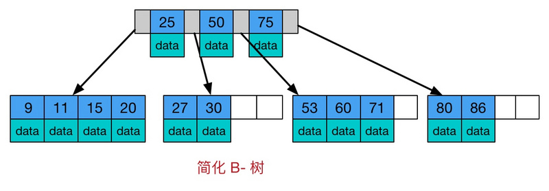

# 数据结构

## B- Tree与B+ Tree


B树是一种多路自平衡搜索树，它类似普通的二叉树，但是B书允许每个节点有更多的子节点。

每个非叶子节点包含有n个关键字信息(n，P0，K1，P1，K2，P2，......，Kn，Pn)，其中：
 a)   Ki (i=1...n)为关键字，且关键字按顺序升序排序K(i-1)< Ki。



B树的特点：

1. 所有键值分布在整个树中
2. 任何关键字出现且只出现在一个节点中
3. 搜索有可能在非叶子节点结束
4. 在关键字全集内做一次查找，性能逼近二分查找算法

B+树是B树的变体，也是一种多路平衡查找树


B+树与B树的不同在于：

1.  所有关键字存储在叶子节点，非叶子节点不存储真正的data
2.  为所有叶子节点增加了一个链指针，指向前一个部分

### 为什么使用B/B+树

索引是以索引文件的形式存在于磁盘中的，
索引的查找过程就会涉及到磁盘IO消耗，
磁盘IO的消耗相比较于内存IO的消耗要高好几个数量级，
所以索引的组织结构要设计得在查找关键字时要尽量减少磁盘IO的次数。

**局部性原理与磁盘预读**

实际过程中，磁盘并不是每次严格按需读取，而是每次都会预读。磁盘读取完需要的数据后，**会按顺序再多读一部分数据到内存中**，这样做的理论依据是计算机科学中注明的局部性原理：

> ```undefined
> 当一个数据被用到时，其附近的数据也通常会马上被使用
> 程序运行期间所需要的数据通常比较集中
> ```

1. 由于磁盘顺序读取的效率很高(不需要寻道时间，只需很少的旋转时间)，因此对于具有局部性的程序来说，预读可以提高I/O效率.预读的长度一般为页(page)的整倍数
2. MySQL(默认使用InnoDB引擎),将记录按照页的方式进行管理,每页大小默认为**16K**。linux 默认页大小为**4K**。

**B-Tree借助计算机磁盘预读的机制**：

1. 每次新建节点时，直接申请一个页的空间，这样就保证一个节点物理上也存储在一个页里，加之计算机存储分配都是按页对齐的，就实现了**一个结点只需一次I/O**。
2. 假设 B-Tree 的高度为 h,B-Tree中一次检索最多需要h-1次I/O（根节点常驻内存），渐进复杂度为O(h)=O(logdN)O(h)=O(logdN)。一般实际应用中，出度d是非常大的数字，通常超过100，因此h非常小（通常不超过3，也即**索引的B+树层次一般不超过三层**，所以查找效率很高）。
3. 红黑树这种结构，h明显要深的多。由于**逻辑上很近的节点（父子）物理上可能很远**，无法利用局部性，所以红黑树的I/O渐进复杂度也为O(h)，效率明显比B-Tree差很多。

### 为什么mysql的索引使用B+树而不是B树

key : 在B+Tree中，所有数据记录节点都是按照键值大小顺序存放在同一层的叶子节点上，而非叶子节点上只存储key值信息，这样可以大大加大每个节点存储的key值数量，降低B+Tree的高度。

通常在B+Tree上有两个头指针，一个指向根节点，另一个指向关键字最小的叶子节点，而且所有叶子节点（即数据节点）之间是一种**链式环结构**。因此可以对B+Tree进行两种查找运算：一种是对于主键的范围查找和分页查找，另一种是从根节点开始，进行随机查找。

1. B+树更适合外部存储(一般指磁盘存储),由于内节点(非叶子节点)不存储data，所以一个节点可以存储更多的内节点，每个节点能索引的范围更大更精确。**也就是说使用B+树单次磁盘IO的信息量相比较B树更大，IO效率更高。**
2. mysql是关系型数据库，经常会按照区间来访问某个索引列，B+树的叶子节点间按顺序建立了链指针，加强了区间访问性，所以B+树对索引列上的区间范围查询很友好。而**B树每个节点的key和data在一起，无法进行区间查找**。


